# Лабораторная работа №2

## Цель
Научиться взаимодействовать с веб-API с помощью скрипта Python.

## Задача
В проекте создайте ветвь с именем . Создайте каталог с именем . Внутри него создайте файл с именем currency_exchange_rate.py  
  
Напишите скрипт на Python (), который будет взаимодействовать с API сервиса. Скрипт должен выполнять следующие функции:  
  
1. Получите курс одной валюты по отношению к другой на указанную дату. Валюты и дата должны быть переданы в качестве параметров командной строки.
2. Сохраните полученные данные в файл в формате JSON. Имя файла должно содержать валюты и дату запроса. Сохраните файл в каталоге, который должен быть создан в корне проекта, если он еще не существует.data
3. Обрабатывать ошибки, возникающие при выполнении запросов к API (например, неверные параметры). Отображайте понятные сообщения об ошибках в консоли и сохраняйте их в файле журнала в корне проекта.error.log
  
Протестируйте скрипт, запустив его с разными параметрами. Период данных: от до .2025-01-012025-09-15  
  
Запустите скрипт для дат в пределах выбранного вами диапазона (не менее 5 дат, с равными интервалами).  

## Ход работы

Создаю новую ветку `lab02`, в которой будет находиться вторая лабораторная. Копирую проект с условия на свою машину(шучу, у меня даже велосипеда нет), где создаю файл с именем `currency_exchange_rate.py`:
```py
#!/usr/bin/env python3
import argparse
import json
import os
import sys
import logging
from datetime import datetime

try:
    import requests
    HAS_REQUESTS = True
except Exception:
    import urllib.request as _urllib_request
    import urllib.parse as _urllib_parse
    HAS_REQUESTS = False

logger = logging.getLogger("currency_exchange")
logger.setLevel(logging.DEBUG)

file_handler = logging.FileHandler("error.log", encoding="utf-8")
file_handler.setLevel(logging.ERROR)
file_handler.setFormatter(logging.Formatter("%(asctime)s %(levelname)s: %(message)s"))
logger.addHandler(file_handler)

console_handler = logging.StreamHandler(sys.stderr)
console_handler.setLevel(logging.ERROR)
console_handler.setFormatter(logging.Formatter("%(levelname)s: %(message)s"))
logger.addHandler(console_handler)


def parse_args():
    p = argparse.ArgumentParser(description="Get currency exchange rate from API and save JSON")
    p.add_argument("from_currency", help="Currency to convert from (e.g. USD)")
    p.add_argument("to_currency", help="Currency to convert to (e.g. EUR)")
    p.add_argument("date", help="Date in format YYYY-MM-DD (between 2025-01-01 and 2025-09-15)")
    p.add_argument("--api-url", default="http://localhost:8080", help="Base URL for the API (default: http://localhost:8080)")
    p.add_argument("--api-key", default=os.environ.get("API_KEY", "EXAMPLE_API_KEY"), help="API key (or set env API_KEY)")
    return p.parse_args()


def validate_inputs(from_c, to_c, date_str):
    allowed = {"MDL", "USD", "EUR", "RON", "RUS", "UAH"}
    from_c = from_c.upper()
    to_c = to_c.upper()
    if from_c not in allowed or to_c not in allowed:
        raise ValueError(f"Unsupported currency. Allowed: {', '.join(sorted(allowed))}")
    try:
        d = datetime.strptime(date_str, "%Y-%m-%d")
    except ValueError:
        raise ValueError("Date must be in YYYY-MM-DD format.")
    start = datetime.strptime("2025-01-01", "%Y-%m-%d")
    end = datetime.strptime("2025-09-15", "%Y-%m-%d")
    if not (start <= d <= end):
        raise ValueError("Date out of available range: 2025-01-01 .. 2025-09-15.")
    return from_c, to_c, date_str


def make_request(api_url, from_c, to_c, date_str, api_key, timeout=10):
    api_url = api_url.rstrip("/")
    url = f"{api_url}/?from={from_c}&to={to_c}&date={date_str}"

    if HAS_REQUESTS:
        try:
            resp = requests.post(url, data={"key": api_key}, timeout=timeout)
            resp.raise_for_status()
            return resp.text, resp.headers.get("Content-Type", "")
        except Exception as e:
            raise ConnectionError(f"HTTP request failed: {e}")
    else:
        try:
            data = _urllib_parse.urlencode({"key": api_key}).encode("utf-8")
            req = _urllib_request.Request(url, data=data, method="POST")
            req.add_header("Content-Type", "application/x-www-form-urlencoded")
            with _urllib_request.urlopen(req, timeout=timeout) as resp:
                raw = resp.read()
                ctype = resp.getheader("Content-Type", "")
                return raw.decode("utf-8"), ctype
        except Exception as e:
            raise ConnectionError(f"HTTP request failed (urllib): {e}")


def save_json_to_file(data_obj, from_c, to_c, date_str):
    os.makedirs("data", exist_ok=True)
    safe_name = f"{from_c}_to_{to_c}_{date_str}.json"
    path = os.path.join("data", safe_name)
    with open(path, "w", encoding="utf-8") as f:
        json.dump(data_obj, f, ensure_ascii=False, indent=2)
    return path


def main():
    args = parse_args()
    try:
        from_c, to_c, date_str = validate_inputs(args.from_currency, args.to_currency, args.date)
    except Exception as e:
        msg = f"Input error: {e}"
        print(msg, file=sys.stderr)
        logger.error(msg)
        sys.exit(2)

    try:
        raw_text, content_type = make_request(args.api_url, from_c, to_c, date_str, args.api_key)
    except Exception as e:
        msg = f"Network/API error: {e}"
        print(msg, file=sys.stderr)
        logger.exception(msg)
        sys.exit(1)

    try:
        parsed = json.loads(raw_text)
    except Exception as e:
        msg = f"Failed to parse JSON response: {e}"
        print(msg, file=sys.stderr)
        logger.exception(msg)
        sys.exit(1)

    if isinstance(parsed, dict) and parsed.get("error"):
        msg = f"API returned error: {parsed.get('error')}"
        print(msg, file=sys.stderr)
        logger.error(msg)
        sys.exit(1)

    try:
        saved_path = save_json_to_file(parsed, from_c, to_c, date_str)
        print(f"Success: saved API response to {saved_path}")
    except Exception as e:
        msg = f"Failed to save data: {e}"
        print(msg, file=sys.stderr)
        logger.exception(msg)
        sys.exit(1)


if __name__ == "__main__":
    main()
```
Данный скрипт получает курс однрй валюты по отношению к другой на указанную дату, сохраняет данные специальный файл json в папке `data` и также обрабатывает ошибки в случае введения неверных параметров.
  
Устанавливаю необходимые зависимости в текстовый файл `requirements.txt` командой:
```
pip freeze > requirements.txt
```
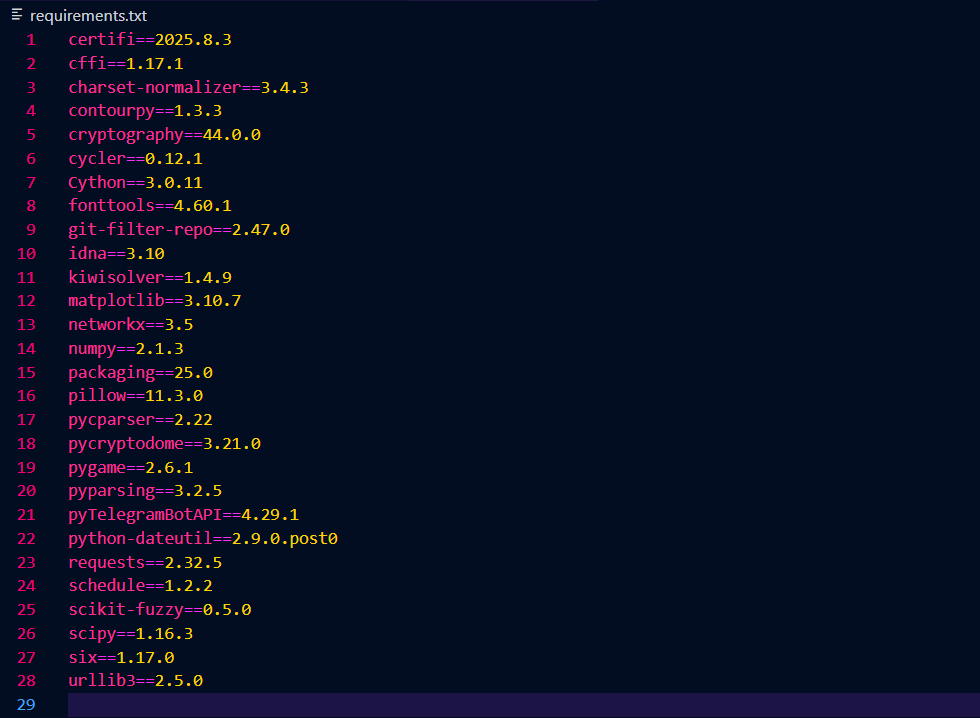  
  

При помощи команды запускаю все сервисы из docker-compose.yml, создаю контейнер и запускаю в фоновом режиме:
```
docker compose up -d
```
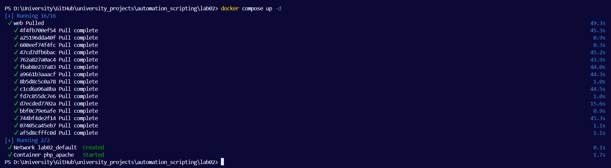  
  
Запускаю скрипт для проверки насколько все идеально работает:  
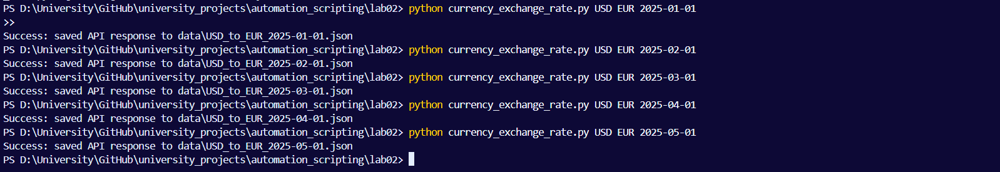  
  
В папке `data` появляются данные на указанную дату о курсе валюты:  
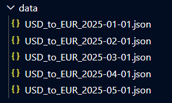  
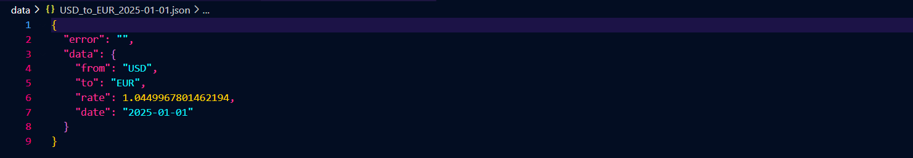  
  
Проверяем обработку ошибок в случае если ввели неправильную валюту:  
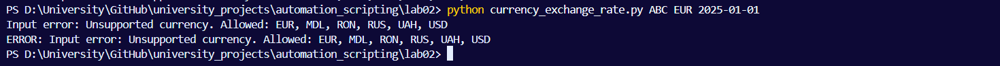   
В лог файле появляется информация о данной ошибке:  
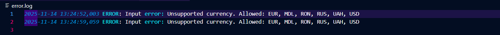  
  
Если ввели дату в неправильном формате:  
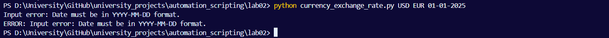  
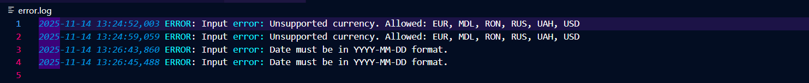

  
Если указанной даты нет в диапазоне:  
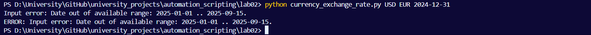  
  
  
И также проверяем взаимодействие с API:  
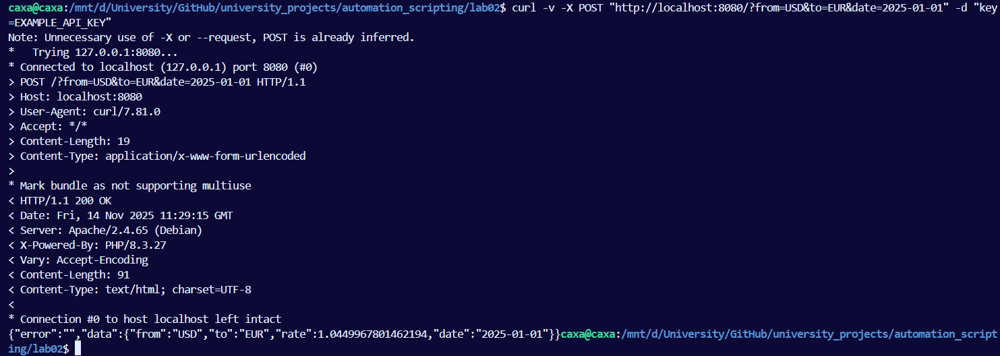   
Итог: всё работает идеально - сервер отвечает, API ключ принимается, json приходит в правильном виде, скрипт может спокойно сохранять этот json.


## Вывод
В ходе работы был развернут сервис обмена валют в Docker и создан Python-скрипт для получения курсов через API с валидацией параметров и сохранением результатов в JSON. Проект протестирован, структурирован для публикации на GitHub, цель лабораторной работы достигнута. Дополнительно реализована обработка ошибок и логирование, что повышает надежность программы. Работа позволила закрепить навыки работы с Web API, Docker и организацией проекта.

И переписывать отчет, потому что все изображения оказались нерабочими после переезда в новый репозиторий  

