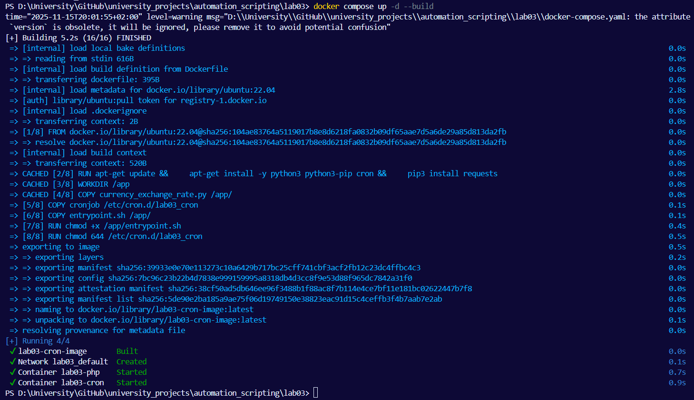
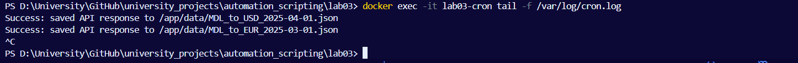
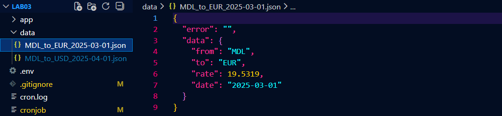

# Лабораторная работа №3. Настройка планировщика заданий (cron)

## Цель
Узнать, как настроить планировщик заданий (cron) для автоматизации выполнения скриптов.

## Задача
В проекте создадим ветку. Создайте директорию и скопируйте туда файлы из лабораторной работы №2. В директории создаем файл, где укажите задачи cron, которые будут запускать скрипт currency_exchange_rate.py:
- Ежедневно в 6:00 утра для получения курса MDL к EUR за предыдущий день.
- Еженедельно в пятницу в 17:00 для получения курса MDL к USD за предыдущую неделю.
  
Создайте в каталоге, основанный на Ubuntu или официальном образе Python:
1. Установите необходимые зависимости для запуска скрипта (cron, Python и необходимые библиотеки).
2. Скопируйте скрипт currency_exchange_rate.py, файл cronjob и скрипт точки входа в контейнер 
3. Настройте cron для выполнения задач, указанных в файле.cronjob
4. Запускайте cron в фоновом режиме при запуске контейнера.
5. Записываем вывод задачи cron в файл ./var/log/cron.log

## Ход работы

Копирую структуру проекта со второй лабораторной в третью. Создаю файл cronjob со следующим содержимым:
```sh
0 6 * * * root python3 /app/currency_exchange_rate.py MDL EUR $(date -d "yesterday" '+\%Y-\%m-\%d') --api-key 1234 >> /var/log/cron.log 2>&1

0 17 * * 5 root python3 /app/currency_exchange_rate.py MDL USD $(date -d "last friday" '+\%Y-\%m-\%d') --api-key 1234 >> /var/log/cron.log 2>&1

```
Первая строка каждый день в 6 часов утра получает курс с леев в евро за предыдущий день и записывает в файл `cron.log`, вторая строка каждую пятницу в 5 часов вечера получает курс с леев в доллары и записывает в тот же файл.
  
Создаю еще один файл `entrypoint.sh`, который является скриптом для запуска cron в контейнере и логирования его работы:
```sh
#!/bin/bash

create_log_file() {
    echo "Creating log file..."
    touch /var/log/cron.log 
    chmod 666 /var/log/cron.log
    echo "Log file created at /var/log/cron.log"
}


monitor_logs() {
    echo "=== Monitoring cron logs ==="
    tail -f /var/log/cron.log
}

run_cron() {
    echo "=== Starting cron daemon ==="
    exec cron -f
}

env > /etc/environment

create_log_file

monitor_logs &

run_cron
```
  
Следующим пунктиком является создание `Dockerfile`:
```sh
FROM ubuntu:22.04

RUN apt-get update && \
    apt-get install -y python3 python3-pip cron && \
    pip3 install requests

WORKDIR /app

COPY currency_exchange_rate.py /app/
COPY cronjob /etc/cron.d/lab03_cron
COPY entrypoint.sh /app/

RUN chmod +x /app/entrypoint.sh
RUN chmod 644 /etc/cron.d/lab03_cron


ENTRYPOINT ["/app/entrypoint.sh"]
```
Он берёт python:3.11-slim, устанавливает cron, копирует скрипт внутрь контейнера /app/, копирует cronjob в /etc/cron.d/, активирует cron задачи, запускает tail логов и cron через entrypoint.
  
Обновляю уже имеющийся `docker-compose.yaml`:
```yml
version: "3.9"

services:
  php_service:
    container_name: lab03-php
    image: php:8.2-apache
    ports:
      - "8080:80"
    environment:
      - API_KEY=1234
    env_file:
      - .env
    volumes:
      - ./app:/var/www/html

  cron_service:
    build: .
    container_name: lab03-cron
    image: lab03-cron-image
    restart: unless-stopped
    depends_on:
      - php_service
    volumes:
      - ./data:/app/data 
```
Он описывает, какие контейнеры нужно запустить, как они связаны, какие порты открыть, какие переменные окружения передать и какие каталоги смонтировать.
  
Собираю и запускаю контейнер в фоновом режиме:  
  
  
Для наглядной проверки дополняю файл `cronjob` следующими тестовыми строками, которые выполняются каждую минуту:
```sh
* * * * * root python3 /app/currency_exchange_rate.py MDL EUR 2025-03-01 --api-key 1234 >> /var/log/cron.log 2>&1
* * * * * root python3 /app/currency_exchange_rate.py MDL USD 2025-04-01 --api-key 1234 >> /var/log/cron.log 2>&1

```
  

После выполнения в папке `data` появляются два json файла с данными:  


## Вывод
В ходе лабораторной работы №3 мы научились автоматизировать получение курсов валют с помощью Python-скрипта и API. Мы настроили задачи cron для ежедневного и еженедельного получения курсов и сохранили результаты в формате JSON. Для удобства работы с файлами и логами использовался Docker-контейнер с монтированием директорий на хост, что позволило наблюдать результаты и отлаживать скрипт. Лабораторная работа показала практическое применение автоматизации и контейнеризации для регулярного выполнения задач.