# Лабораторная работа №5. Ansible Playbook для настройки сервера

## Цель
Научиться создавать сценарии Ansible для автоматизации настройки сервера.

## Ход работы

```cmd
ssh-keygen -t rsa -b 4096 -f id_rsa_ansible -N '""'
```
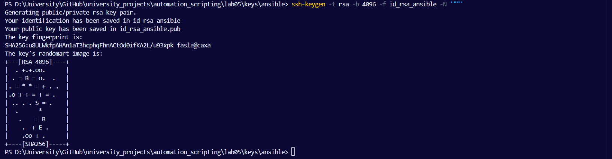


```cmd
docker compose up -d --build
```
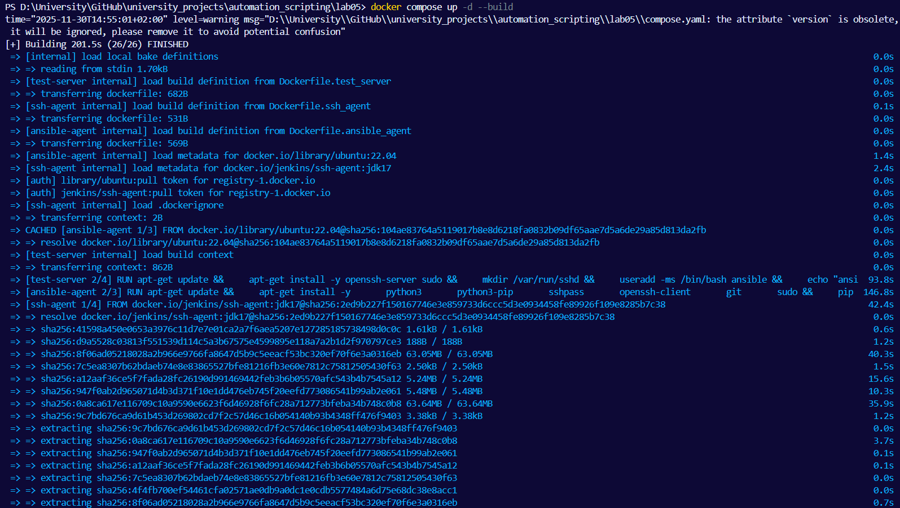

```cmd
docker ps
```
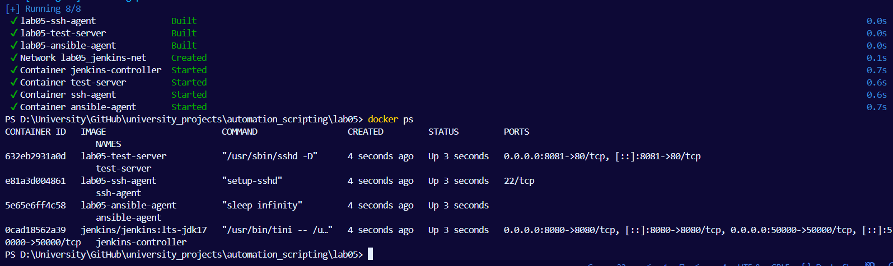

`http://localhost:8080`

```cmd
docker exec -it jenkins-controller cat /var/jenkins_home/secrets/initialAdminPassword
```
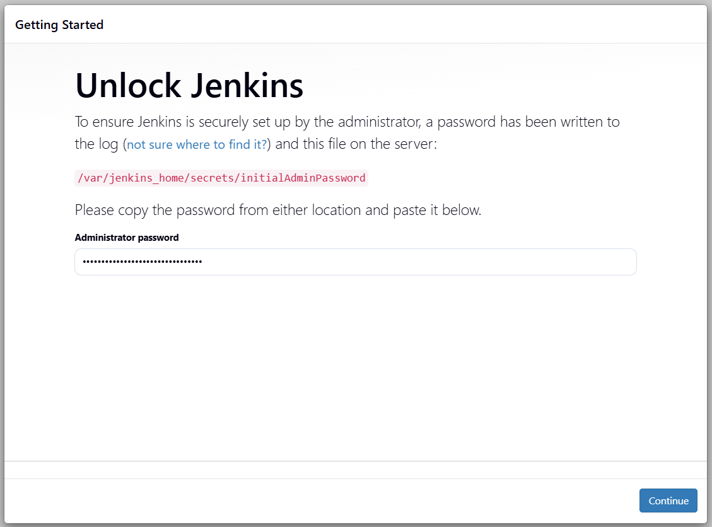

Жду пока установятся все плагины:
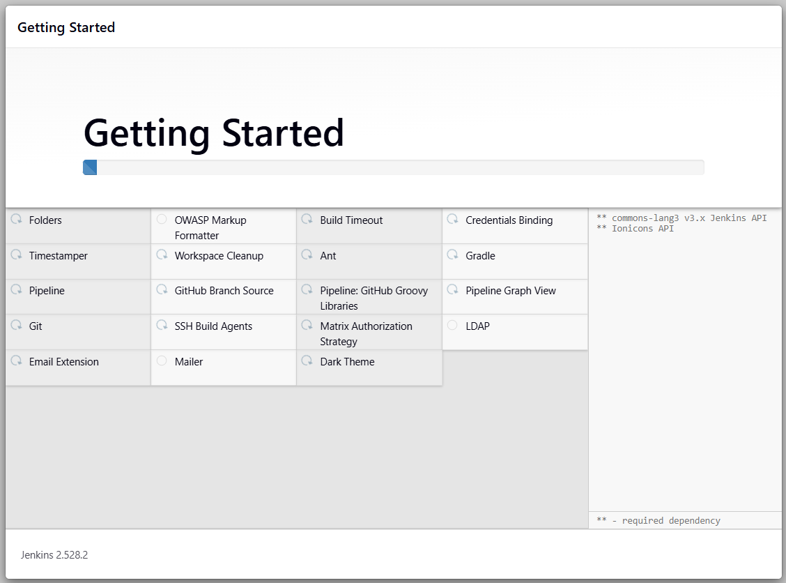

Регистрирую админского пользователя, заполнив все необходимые поля:
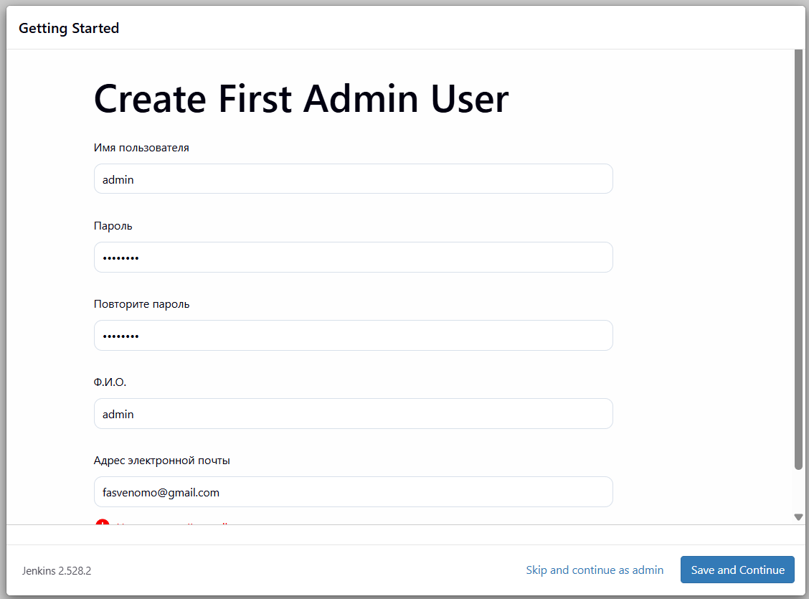

Устанавливаю также дополнительные плагины, перейдя во вкладку `Настроить Jenkins` -> `Plugins`:
- Docker
- Docker Pipeline
- SSH Agent

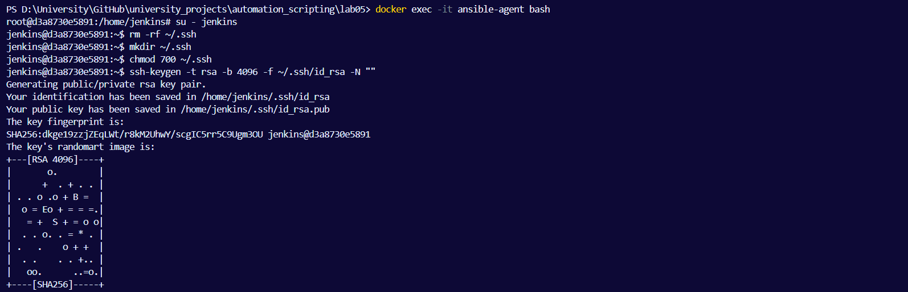
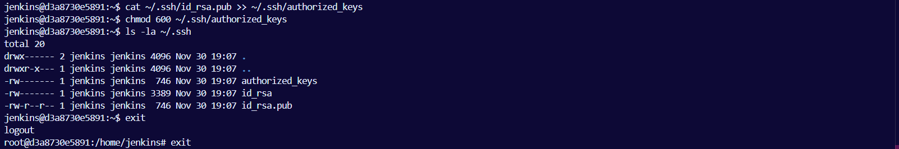

Добавляю SSH credentials `Manage Jenkins` -> `Credentials` со следующими данными:
- Тип: SSH Username with private key
- ID: ansible-key
- Username: jenkins
- Private Key: Enable и вставляю приватный ключ из файла `id_rsa_ansible_agent`
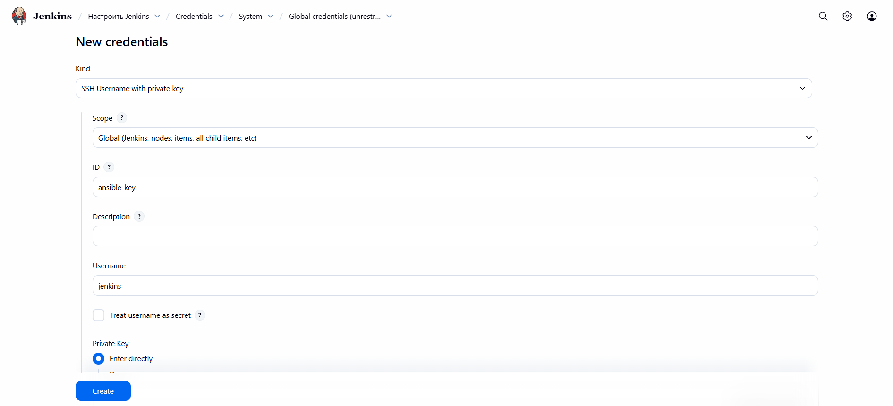

С помощью ловких движений рук совершаю невиданное(генерирую ключ для пользователя jenkins) для дальнейшего создания Credential:
```cmd
docker exec -it ssh-agent bash # захожу в контейнер ssh-agent
ssh-keygen -t rsa -b 4096 -f /home/jenkins/.ssh/id_rsa -N "" # генерирую SSH ключ
cat /home/jenkins/.ssh/id_rsa.pub >> /home/jenkins/.ssh/authorized_keys # добавляю публичный ключ в authorized_keys
chmod 600 /home/jenkins/.ssh/authorized_keys
chown jenkins:jenkins /home/jenkins/.ssh/authorized_keys
```

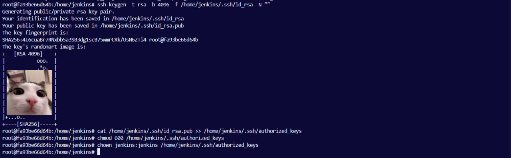
- Тип: SSH Username with private key
- ID: jenkins-to-ssh-agent
- Username: jenkins
- Private Key: Enable и вставляю сюды приватный ключ, сделанный выше
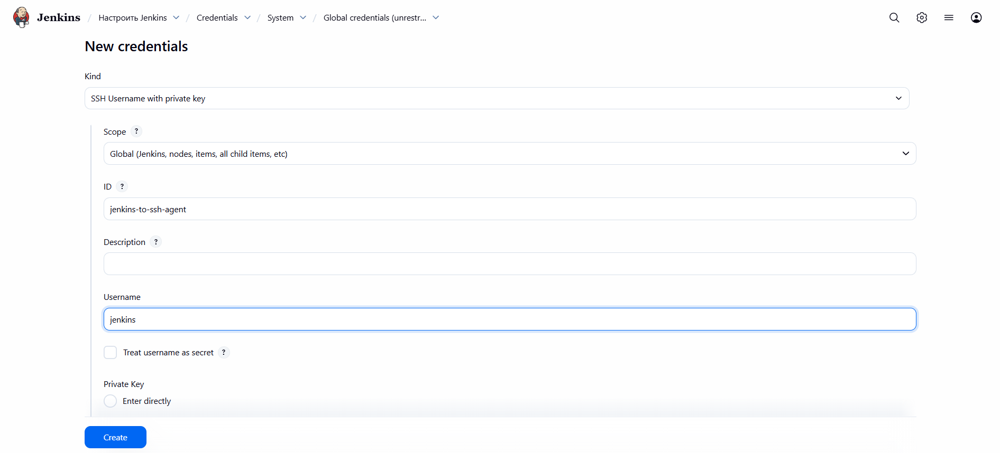


- Название узла: php-ssh-agent
- Тип: Постоянный агент
- Удалённая корневая директория: /home/jenkins
- Метки: php-ssh-agent
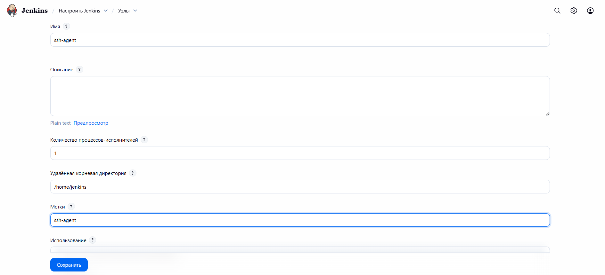


- Способ запуска: Launch agents via SSH
- Host: ssh-agent
- Credentials: jenkins
- Host Key Verification Strategy: Manually trusted key Verification (по прошлому опыту)
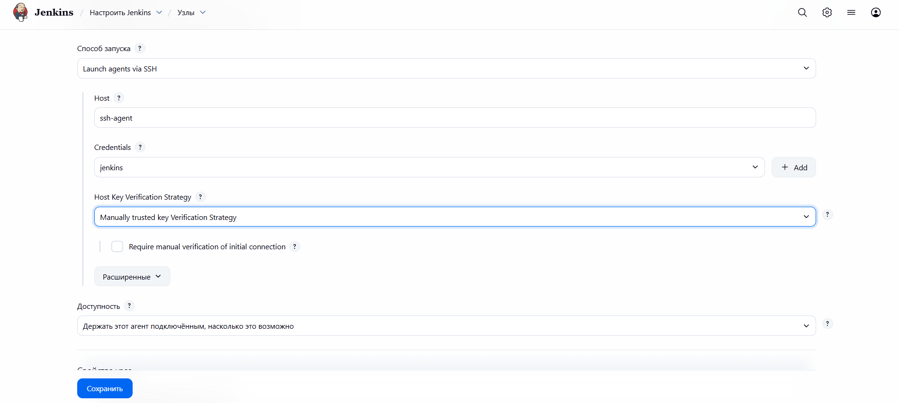

Сохраняем ребятушку и видим, что она успешно запустилась:
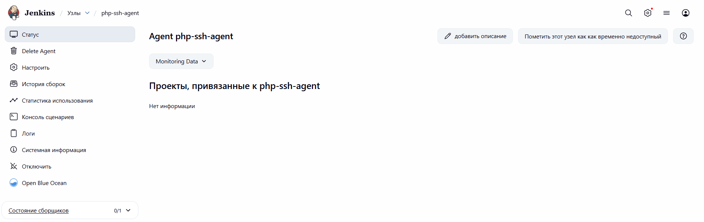


Второй Node
- Название узла: ansible-agent
- Тип: Постоянный агент
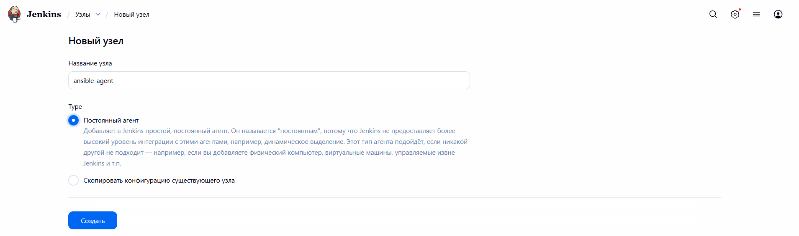

- Удалённая корневая директория: /home/jenkins
- Метки: ansible-agent
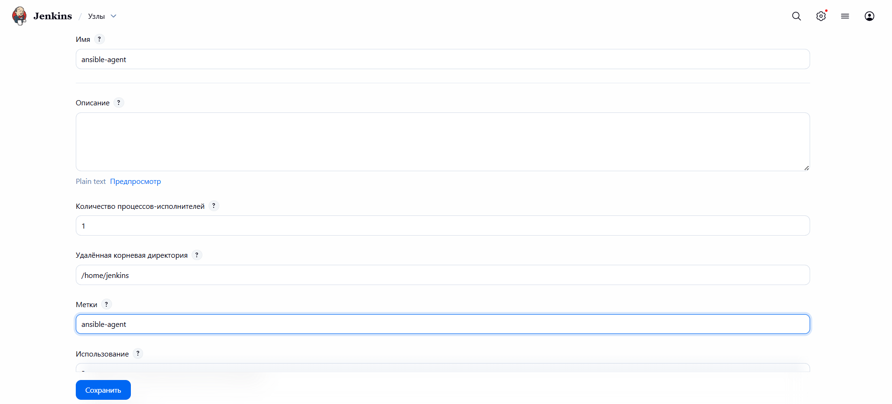

- Способ запуска: Launch agents via SSH
- Host: ansible-agent
- Credentials: тоже jenkins
- Host Key Verification Strategy: Manually trusted key Verification
