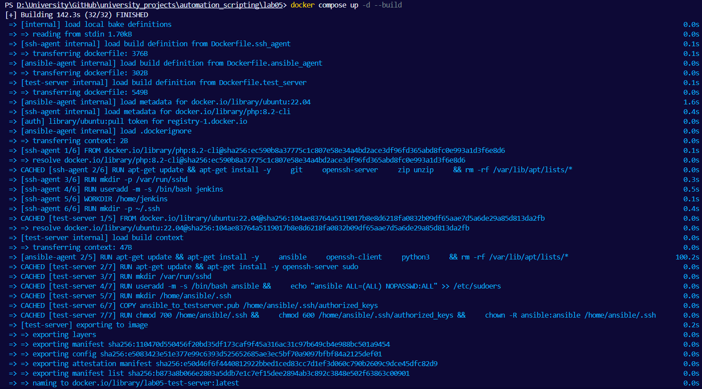
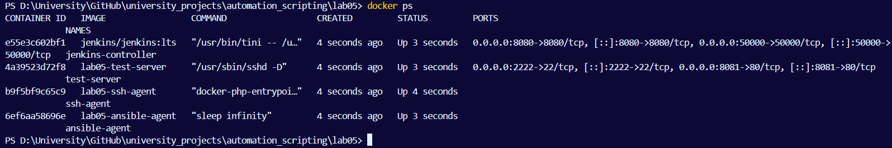

# Лабораторная работа №5. Ansible Playbook для настройки сервера

## Цель
Научиться создавать сценарии Ansible для автоматизации настройки сервера.

## Ход работы

### 1. Установка и настройка Jenkins

Для начала создаю следующую структуру проекта:
```
lab05/
│── compose.yaml
│── Dockerfile.ansible_agent
│── Dockerfile.ssh_agent
│── Dockerfile.test_server
│── ansible/
│     ├── deploy_project.yml
│     ├── hosts.ini
│     ├── setup_test_server.yml   
│     └── vhost.tpl
│── pipelines/
│     ├── ansible_setup_pipeline.groovy
│     ├── php_build_and_test_pipeline.groovy
│     └── php_deploy_pipeline.groovy
└── project/ - пока что пустая папка для php-проекта
```

Создаю сервис `jenkins-controller` в Docker compose файле `compose.yaml`:
```yaml
services:
  jenkins-controller:
    image: jenkins/jenkins:lts
    container_name: jenkins-controller
    ports:
      - "8080:8080"
      - "50000:50000"
    volumes:
      - jenkins_home:/var/jenkins_home
    environment:
      - JAVA_OPTS=-Dhudson.footerURL=https://jenkins.io
volumes:
  jenkins_home:
```

Далее проверяю работоспособность, собирая контейнер командой:
```cmd
docker compose up -d
```


Перехожу по URL `http://localhost:8080/` и попадаю в веб-среду `Jenkins`, где нужно ввести админский пароль для дальнейшей работы, поэтому использую следующую команду, чтобы получить свое заслуженное:
```cmd
docker exec -it jenkins-controller cat /var/jenkins_home/secrets/initialAdminPassword
```

Копирую пароль и вставляю в нужное поле:


Жду установку всех необходимых плагинов:


Создаю админского пользователя, дав ему имя, пароль и емейл:


Затем, перейдя во вкладку `Настройка Jenkins` -> `Plugins` устанавливаю дополнительные плагины для работы:
- Docker
- Docker Pipeline
- GitHub Integration
- SSH Agent
  


 ????


### 2. Настройка SSH-агента

Перехожу к настройке `ssh-agent`, заполняю файл `Dockerfile.ssh_agent` установкой `PHP 8.2`, `Composer`, `git`, `unzip`, `openssh-client`, созданием пользователя `jenkins` и подключением папки проекта `/home/jenkins/project`:
```dockerfile
FROM php:8.2-cli

RUN apt-get update && apt-get install -y \
    git \
    unzip \
    zip \
    curl \
    openssh-client \
    openssh-server \
    && rm -rf /var/lib/apt/lists/*

RUN useradd -m -s /bin/bash jenkins

RUN curl -sS https://getcomposer.org/installer | php -- --install-dir=/usr/local/bin --filename=composer

RUN chown -R jenkins:jenkins /home/jenkins

USER jenkins
WORKDIR /home/jenkins

RUN mkdir -p /home/jenkins/.ssh

CMD ["sleep", "infinity"]
```

Обновляю файл `compose.yaml`, добавляя сервис `ssh-agent`:
```yaml
ssh-agent:
    build:
      context: .
      dockerfile: Dockerfile.ssh_agent
    container_name: ssh-agent
    volumes:
      - ./project:/home/jenkins/project
      - ./jenkins_ssh_agent:/home/jenkins/.ssh/id_rsa
    tty: true
```

Генерирую пару ssh-ключей - приватный и публичный - командой:
```cmd
ssh-keygen -t rsa -b 4096 -f jenkins_ssh_agent
```


Приватный ключ смонтирован в контейнер:
```yaml
volumes:
  - ./jenkins_ssh_agent:/home/jenkins/.ssh/id_rsa
```

И устанавливаю ключам права доступа:
```bash
chmod 600 jenkins_ssh_agent - только владелец файла может читать и перезаписывать
chmod 644 jenkins_ssh_agent.pub - только владелец может перезаписывать, остальные пользователи читать
```


### 3. Создание Ansible Agent

Далее создаю `ansible-agent`, в файле `Dockerfile.ansible_agent` прописываю установку `ansible`, `openssh-client` и создаю пользователя `ansible`:
```dockerfile
FROM ubuntu:22.04

RUN apt-get update && apt-get install -y \
    ansible \
    openssh-client \
    python3 \
    && rm -rf /var/lib/apt/lists/*

RUN useradd -m -s /bin/bash ansible

USER ansible
WORKDIR /home/ansible
RUN mkdir -p ~/.ssh

CMD ["sleep", "infinity"]
```

Обновляю `compose.yaml`, также добавляя еще `ansible-agent`:
```yaml
ansible-agent:
    build:
      context: .
      dockerfile: Dockerfile.ansible_agent
    container_name: ansible-agent
    volumes:
      - ./:/home/ansible/project
      - ./ansible_to_testserver:/home/ansible/.ssh/test_server_key
    tty: true
```

Для данного агента тоже генерирую две пары ключей командой:
```
ssh-keygen -t rsa -b 4096 -f ansible_to_testserver
```


Ключ добавляется в `authorized_keys` на тестовый сервер:
```yaml
volumes:
  - ./ansible_to_testserver:/home/ansible/.ssh/test_server_key
```

В папке `ansible` также создаю файл `hosts.ini`, который описывает инвентарь, т.е список серверов, с которыми `Ansible` может работать:
```ini
[testserver]
test-server ansible_host=test-server ansible_user=ansible ansible_ssh_private_key_file=/home/ansible/.ssh/test_server_key ansible_port=22
```
Без `hosts.ini` Ansible вообще не знает, куда отправлять команды.


### 4. Создание тестового сервера

Для настройки тестового сервера дополняю файл `Dockerfile.test_server`, основанный на Ubuntu:
```dockerfile
FROM ubuntu:22.04

RUN apt-get update && apt-get install -y openssh-server sudo
RUN mkdir /var/run/sshd

RUN useradd -m -s /bin/bash ansible && \
    echo "ansible ALL=(ALL) NOPASSWD:ALL" >> /etc/sudoers

RUN mkdir /home/ansible/.ssh
COPY ansible_to_testserver.pub /home/ansible/.ssh/authorized_keys

RUN chmod 700 /home/ansible/.ssh && \
    chmod 600 /home/ansible/.ssh/authorized_keys && \
    chown -R ansible:ansible /home/ansible/.ssh

EXPOSE 22
CMD ["/usr/sbin/sshd", "-D"]
```
Этот докерфайл устанавливает openssh-server, создает пользователя ansible и настраивает доступ по ssh, используемые порты для `Apache` -> 8081, для `SSH` -> 2222
  
Останавливаю старый и удаляю старые ресурсы `Docker Compose`, и запускаю снова с новыми:
```
docker compose down
docker compose up -d --build
```

  
Проверяю запустились ли все необходимые контейнеры:
```
docker ps
```


### 5. Создание Ansible Playbook для настройки тестового сервера

Создаю сценарий `ansible/setup_test_server.yml`, который автоматически подготавливает тестовый сервер к работе php-приложения, внутри находится установка `Apache2`, `PHP` и все необходимые расширения, включение php-модуля в `Apache`, настройка виртуального хоста `Apache` и перезапуск самого `Apache`:
```yml
---
- name: Configure test server
  hosts: testserver
  become: yes

  tasks:
    - name: Install Apache and PHP
      apt:
        name:
          - apache2
          - php
          - libapache2-mod-php
          - php-cli
          - php-mbstring
          - php-xml
          - php-zip
        state: present
        update_cache: yes

    - name: Enable Apache mods
      command: a2enmod php*

    - name: Create virtual host
      template:
        src: vhost.tpl
        dest: /etc/apache2/sites-available/000-default.conf

    - name: Restart apache
      service:
        name: apache2
        state: restarted
```
В результате сервер становится полностью готова к работе: Apache запущен, PHP настроен, а виртуальный хост обслуживает проект. 


Далее создаю второй плэйбук `ansible/deploy_project.yml`, который отвечает за развертывание php-приложения на сервер. Там происходит создание каталога проекта, копирование файлов php-приложения, копировани css стилей и исходников, также перезапуск `Apache`, таки образом, этот сценарий обеспечивает полный цикл обнолвения приложение на тестовом сервере (но оч долго :( ):
```yml
---
- name: Deploy PHP project
  hosts: testserver
  become: yes

  tasks:
    - name: Copy project files
      copy:
        src: ../project/
        dest: /var/www/html/project/
        owner: www-data
        group: www-data
        mode: '0755'

    - name: Restart apache
      service:
        name: apache2
        state: restarted

```

И перехожу к файлу `vhost.tpl` в той же директории, это шаблон виртаульного хоста `Apachi`, который Ansible копирует на сервер:
```tpl
<VirtualHost *:80>
    DocumentRoot /var/www/html/project
    <Directory /var/www/html/project>
        AllowOverride All
        Require all granted
    </Directory>
</VirtualHost>
```

### 6-8. Создание Jenkins pipeline-ов

Вся конфигурация конвейеров находится в папке `pipelines/`. Начинаю с первого пайплайна для сборки и тестирования php, в файле `php_build_and_test_pipeline.groovy` `Jenkins` клонирует актуальную версию проекта, устанавливает зависимости `Composer`, запускает `PHPUnit` тесты:
```groovy
pipeline {
    agent { label 'ssh-agent' }

    stages {
        stage('Checkout') {
            steps {
                echo 'Cloning repository...'
                checkout scm
            }
        }

        stage('Install Composer Dependencies') {
            steps {
                echo 'Installing Composer dependencies...'
                sh 'composer install'
            }
        }

        stage('Run Tests') {
            steps {
                echo 'Running PHPUnit tests...'
                sh './vendor/bin/phpunit --testdox'
            }
        }
    }

    post {
        always {
            echo 'Pipeline completed.'
        }
        success {
            echo 'Build & Test pipeline finished successfully!'
        }
        failure {
            echo 'Pipeline failed — check test logs.'
        }
    }
}
```

Второй конвейер является настройкой тествоого сервера `ansible_setup_pipeline.groovy`, он инициирует автоматическую подготовку test-server - вызывает `ansible-agent`, выполняет сценарий `setup_test_server.yml`, также устанавливает `Apache`, `PHP` и готовит все окружение:
```groovy
pipeline {
    agent { label 'ansible-agent' }

    stages {
        stage('Clone repo') {
            steps {
                git 'https://github.com/your/lab05.git'
            }
        }
        stage('Run Ansible Playbook') {
            steps {
                sh 'ansible-playbook -i ansible/hosts.ini ansible/setup_test_server.yml'
            }
        }
    }
}
```

А следующий конвейер - это деплой php-приложения `php_deploy_pipeline.groovy`:
```groovy
pipeline {
    agent { label 'ansible-agent' }

    stages {
        stage('Clone PHP project') {
            steps {
                git 'https://github.com/your/php-project.git'
            }
        }
        stage('Copy files to server') {
            steps {
                sh 'scp -i ~/.ssh/test_server_key -r ./test-server:/var/www/html/project'
            }
        }
        stage('Configure (via Ansible)') {
            steps {
                sh 'ansible-playbook -i ansible/hosts.ini ansible/setup_test_server.yml'
            }
        }
    }
}
```
Тут выполняется Ansible плэйбук `deploy_project.yml`, обновляется приложение на test-server и перезапускается `Apache`. Конкретно этот пайплйн отвечает за доставку нового кода в тестовую среду.


### 9. Тестирование развернутого PHP-проекта

На данном этапе я в папку `project` добавляю свой php-проект, захожу вручную внутрь `ansible-agent`:
```cmd
docker exec -it ansible-agent bash
```
Использую команду, которая автоматически конфигурирует тестовый сервер, устанавливая Apache и PHP, настраивая виртуальный хост и подготавливая сервер к запуску PHP-приложения:
```bash
ansible-playbook -i ansible/hosts.ini ansible/setup_test_server.yml
```


По завершению загрузки, захожу в `ssh-agent`, чтобы убедиться, что папка `/home/jenkins/project
` содержит файлы php-проекта, смонтированные через docker volume;
```cmd
docker exec -it ssh-agent bash
```


В контейнере `ssh-agent` не установился `Composer`, что мешало двигаться дальше, так что я установила его вручную, все еще находясь в bash агента:
```bash
composer install
```


И запускаю вручную `PHPUnit` тесты, он автоматически находит тестовые классы и выполняет их:
```bash
./vendor/bin/phpunit --testdox

```


Захожу заново в bash `ansible-agent` и использую команду, которая нужна для автоматической настройки тестового сервера: установки Apache, PHP и подготовки окружения для работы приложения:
```bash
ansible-playbook -i ansible/hosts.ini ansible/setup_test_server.yml
```


После загрузки всех необходимых компонентов перехожу наконец-то по URL `http://localhost:8081/` и вижу свой невероятный php-прожект:


## Контрольные вопросы
**1. Каковы преимущества использования Ansible для настройки сервера?**
Ansible обеспечивает простой и декларативный способ управления конфигурациями. Он не требует установки агентов на серверах, использует обычный SSH, а его плейбуки являются идемпотентными — повторный запуск не нарушает систему. Благодаря модульности и читаемости YAML-файлов Ansible легко поддерживать и масштабировать.

**2. Какие ещё модули Ansible существуют для управления конфигурацией?**
В Ansible существует множество модулей, среди которых apt/yum для пакетов, service для управления сервисами, user и group для управления пользователями, copy и template для файлов, git для работы с репозиториями, docker для контейнеров и systemd для служб. Эти модули позволяют автоматизировать практически любую задачу на сервере.

**3. С какими проблемами вы столкнулись при создании сценария Ansible и как вы их решили?**
Основные проблемы были связаны с правами доступа, отсутствующими пакетами и неверной конфигурацией SSH. Проблема с Apache устранялась запуском корректного playbook-а и настройкой виртуального хоста. Каждая проблема решалась поэтапной проверкой и корректировкой Dockerfile-ов, playbook-ов и hosts.ini.

## Вывод
В ходе выполнения лабораторной работы была развёрнута полноценная инфраструктура CI/CD на базе Docker, Jenkins и Ansible. Были настроены агенты для выполнения сборок и конфигурации серверов, создан тестовый сервер и написаны playbook-и для его автоматической настройки и деплоя PHP-приложения. В результате удалось полностью автоматизировать процесс установки окружения, тестирования и развертывания приложения, что демонстрирует преимущества современной DevOps-практики и подтверждает важность инструментов автоматизации в разработке и сопровождении систем.
