# Лабораторная работа №4. Облачное хранилище данных. Amazon S3

## Цель
Познакомиться с сервисом Amazon S3 (Simple Storage Service) и отработать основные операции:
- создание публичного и приватного бакетов;
- загрузку и организацию объектов;
- работу с S3 через AWS CLI (копирование, перемещение, синхронизация);
- настройку версионирования и шифрования;
- использование S3 Static Website Hosting;
- применение Lifecycle-правил для архивирования старых данных.

## Ход работы

### Шаг 1. Подготовка
  
На главной странице AWS выбираю регион `eu-central-1` (Frankfurt). Создаю также следующую структуру проекта:
```
lab04/
├── public/
│   ├── avatars/
│   │   ├── user1.jpg
│   │   └── user2.jpg
│   └── content/logo.png
├── private/
│   └── logs/
│       └── activity.csv
└── readme.md
```


---


### Шаг 2. Создание бакетов
  
Для создания бакетов использую вариант с использованием ACL.
   
  > **Чем отличаются два способа управления доступом к бакетам в S3?** ACL можно задавать доступ на уровне отдельных объектов. Object Ownership Enforced - ACL выключены, доступы управляются только через IAM/Policies
  
Создаю публичный бакет с именем `lab4-cc-pub-k15` и регионом `eu-central-1`:
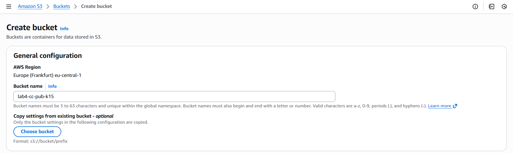\
Object Ownership - `ACLs enabled`:
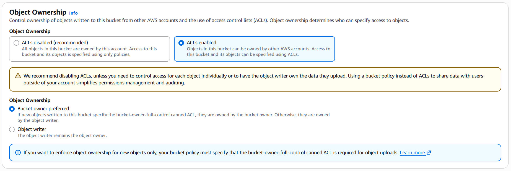\
Block all public access - убираю галочку, чтобы разрешить публичность, и подтверждаю предупреждение:
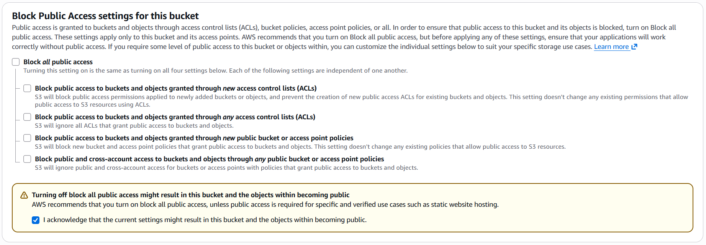

  > **Что означает опция “Block all public access” и зачем нужна данная настройка?** Это глобовая защита, которая запрещает сделать бакет или объекты публичными. Если она включена, нельзя опубликовать ничего наружу через ACL/Policy.

Теперь создаю приватный бакет с именем `lab4-cc-priv-k15` с тем же регионом:
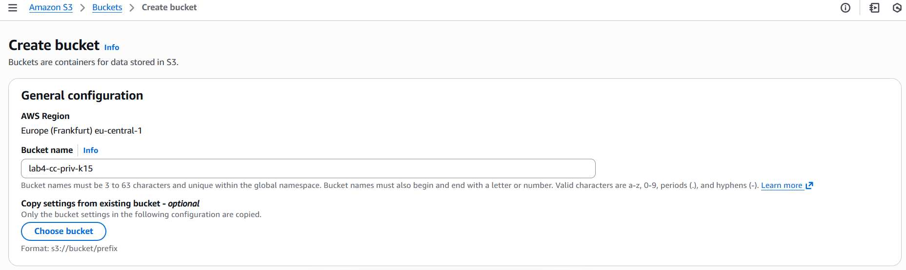\
Так же включаю ACLs:
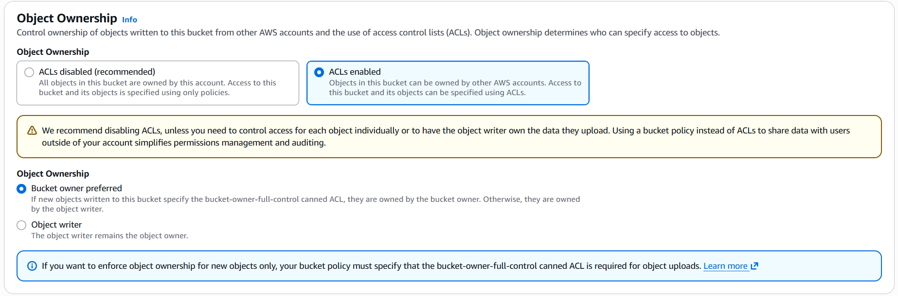\
Block all public access - оставляю галочку по умолчанию:
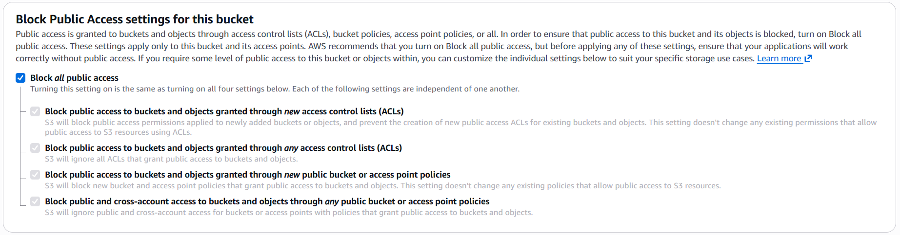

Публичный и приватный бакеты успешно созданы:
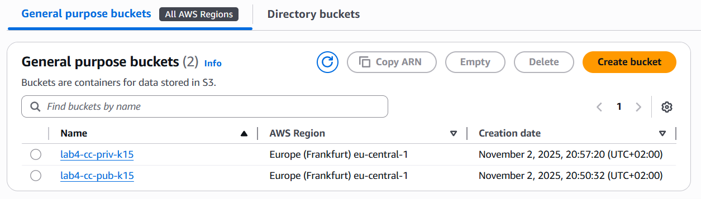

---

### Шаг 3. Загрузка объектов через AWS Management Console

Перехожу в публичный бакет в директорию `avatars/` и нажимаю на кнопку `Upload`:
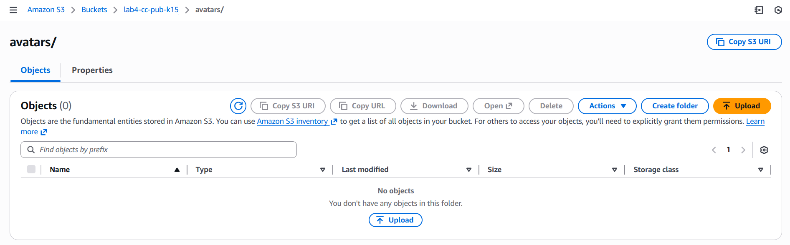\
Загружаю имагу `user1` из локальной папки по пути `lab04/public/avatars/`:
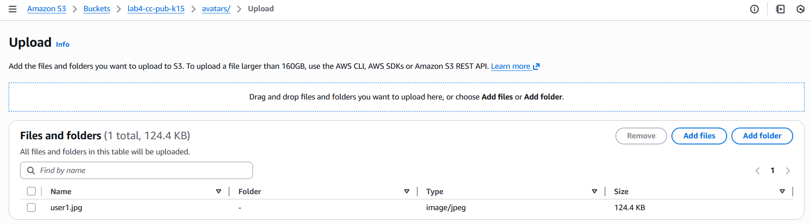\
Далее в пункте `Permissions` выбираю "Grant public-read access":
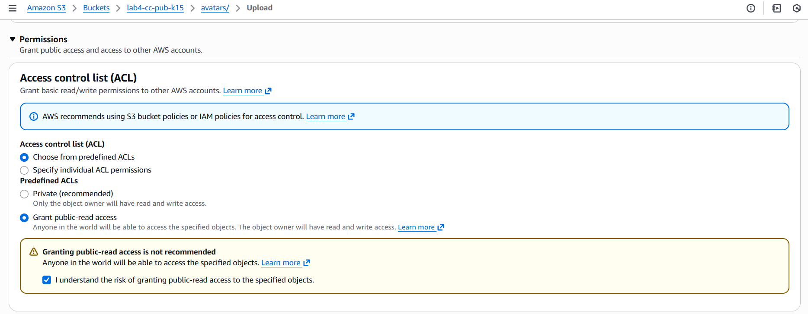

> **Чем отличается ключ (object key) от имени файла?** Object key - полный путь/идентификатор объекта внутри бакета, уникален в бакете, например avatars/user1.jpg. Имя файла (например user1.jpg) - часть ключа, но не уникальное само по себе без префикса.


### Шаг 4. Загрузка объектов через AWS CLI

Настроив `credentials` в AWS CLI, выполняю команду для загрузку файла `user2.jpg` в публичный бакет:
```
aws s3 cp lab04/public/avatars/user2.jpg s3://lab4-cc-pub-k15/avatars/user2.jpg --acl public-read
```
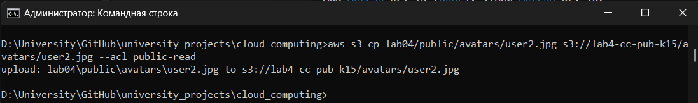

Загружаю файл `logo.png` в публичный бакет, в директорию content/, также сделав его публичным:
```
aws s3 cp lab04/public/content/logo.png s3://lab4-cc-pub-k15/content/logo.png --acl public-read
```
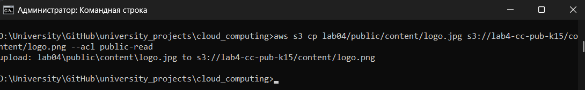

Загружаю файл `activity.csv` в приватный бакет, не делая его публичным:
```
aws s3 cp lab04/private/logs/activity.csv s3://lab4-cc-priv-k15/logs/activity.csv 
```
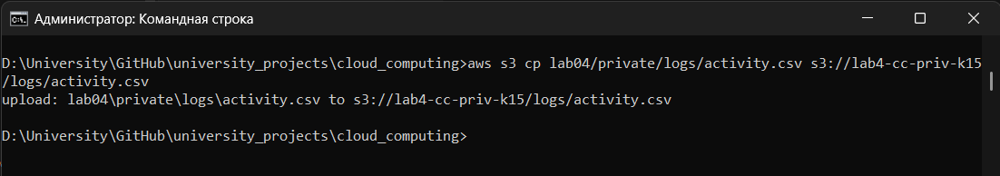


 > **В чём разница между командами aws s3 cp, mv и sync и для чего используется параметр флаг --acl public-read?** cp - копирует файл/директорию (оставляет источник), mv - перемещает (после загрузки удаляет источник), sync - синхронизирует каталоги (загружает только то, чего нет или что изменилось). --acl public-read назначает объекту ACL, дающую право чтения всем (публичный доступ через интернет).


---

### Шаг 5. Проверка доступа к объектам

Для проверки публичного доступа перехожу по URL:
```
https://lab4-cc-pub-k15.s3.eu-central-1.amazonaws.com/avatars/user1.jpg
```
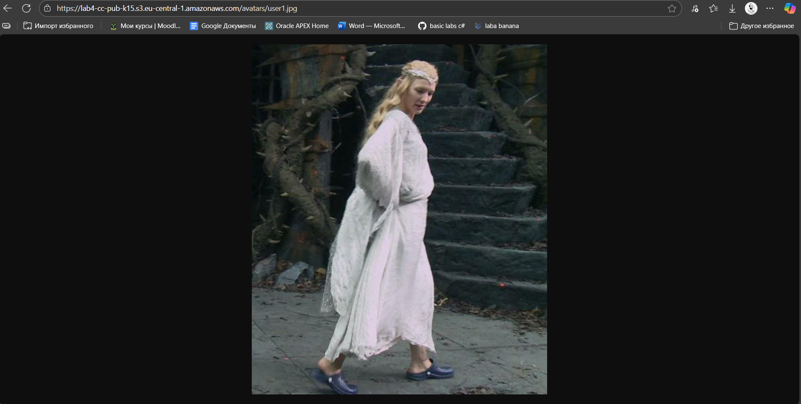

Для проверки приватного доступа перехожу по URL:
```
https://lab4-cc-priv-k15.s3.eu-central-1.amazonaws.com/logs/activity.csv
```
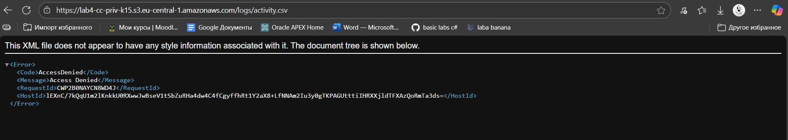

---

### Шаг 6. Версионирование объектов

Включаю версионирование для обоих бакетов через вкладку `Properties` → `Bucket Versioning` → `Enable`:
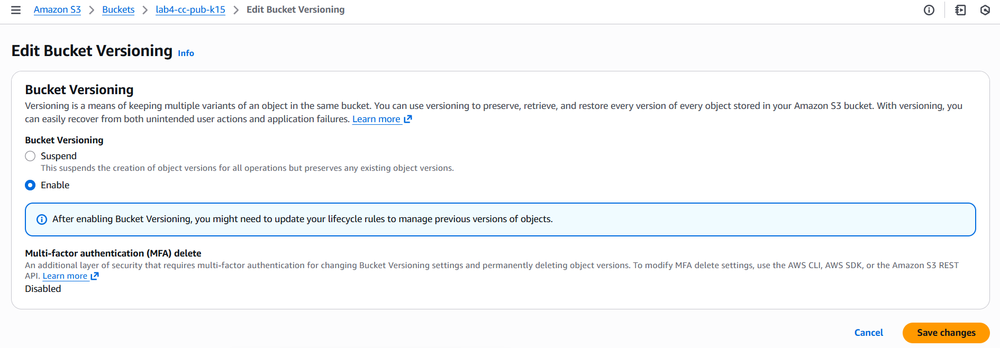


Меняю файл `logo.jpg` и загружаю его заново, чтобы увидеть создание новой версии:
```
aws s3 cp lab04/public/content/logo.png s3://lab4-cc-pub-k15/content/logo.png --acl public-read
```
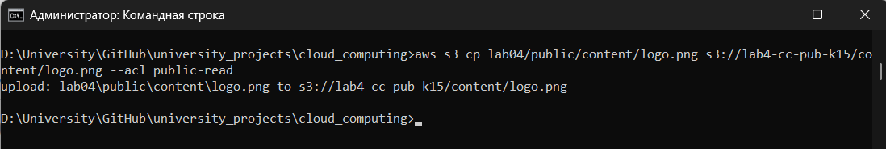

Смотрю вкладку `Versions`, где отображаются все версии объекта:
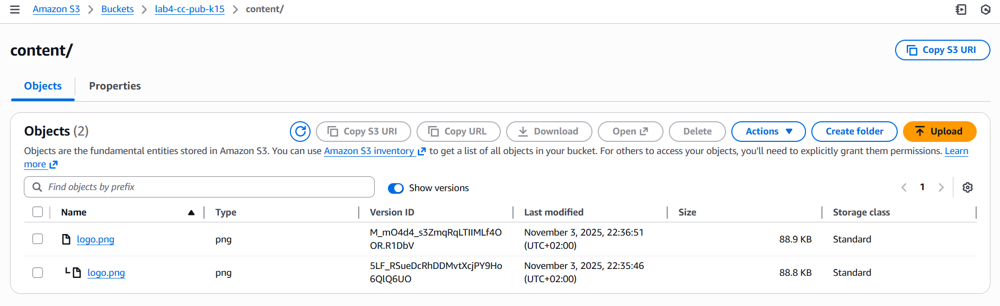

 > **Что произойдёт, если выключить версионирование после его включения?** Если выключить версионирование после его включения: существующие версии сохранятся и будут доступны, а новые загрузки объектов не будут создавать новые версии, они будут перезаписывать текущую версию (без сохранения истории).

---

### Шаг 7. Создание Lifecycle-правил для приватного бакета

В приватном бакете захожу в `Management` → `Lifecycle rules` → `Create rule`. Задаю имя `logs-archive` и префикс `logs/`:
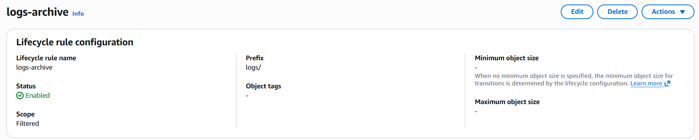
Actions (действия с объектами):
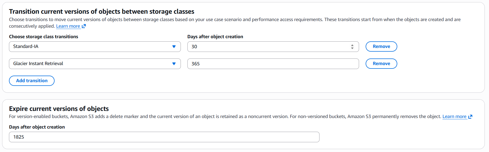

 > **Что такое Storage Class в Amazon S3 и зачем они нужны?** Storage Class - это тип хранения объекта в S3 (например, Standard, Standard-IA, Glacier, Glacier Deep Archive). Используется для оптимизации расходов и управления жизненным циклом данных.

---

### Шаг 8. Создание статического веб-сайта на базе S3

Создаю третий бакет под именем `lab4-cc-web-k15` и регионом `eu-central-1`:

Делаю его публичным, убрав галочки у Block Public Access и ращрешаю ACLs:
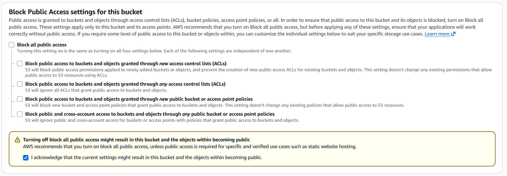

Перехожу в бакет → `Properties` → `Static website hosting` → `Edit` -> `Enable` и выбираю следующие параметры:
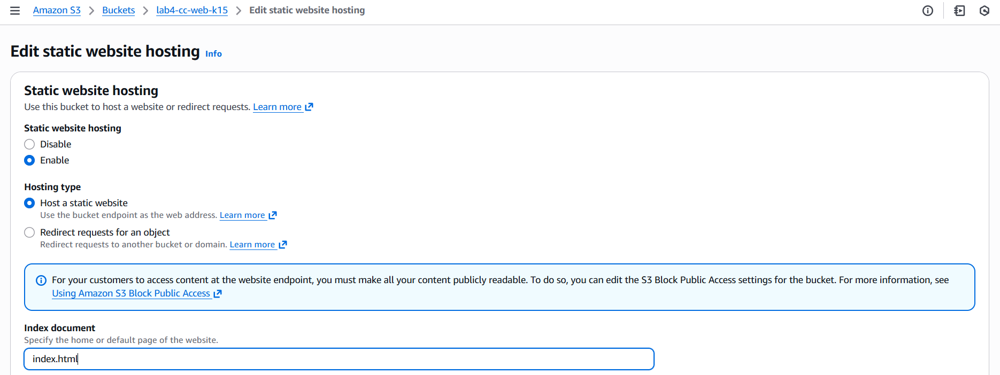
Загружаю файлы проекта в бакет:
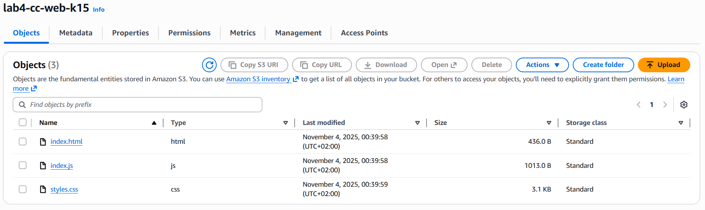
Даю публичный доступ каждому файлу:
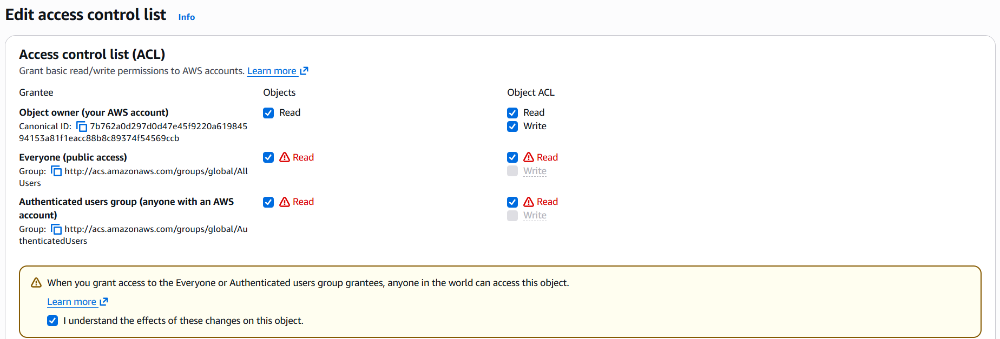

Далее проверяю работоспособность веб-страницы, перейдя по URL `index.html`:
```
https://lab4-cc-web-k15.s3.eu-central-1.amazonaws.com/index.html
```
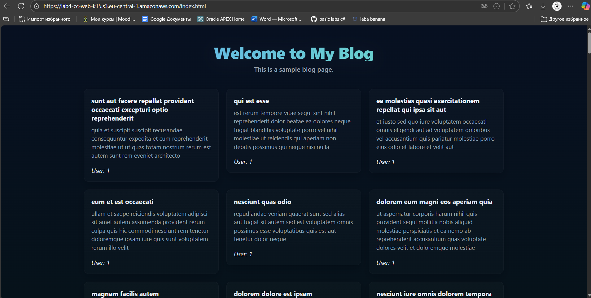

## Заключение
В ходе лабораторной работы мы создали бакеты, загрузили разные файлы, сделали часть объектов публичными, научились управлять доступами с помощью ACL, включили версионирование, настроили Lifecycle-правила для архивирования логов и развернули статический сайт прямо в бакете.

## Библиография

- https://github.com/MSU-Courses/cloud-computing/tree/main/_lab/04_Cloud_Storage
- https://docs.aws.amazon.com/AmazonS3/latest/userguide/Welcome.html