# Лабораторная работа №5. Облачные базы данных. Amazon RDS, DynamoDB

## Цель
Целью работы является ознакомиться с сервисами Amazon RDS (Relational Database Service) и Amazon DynamoDB, а также научиться:
- Создавать и настраивать экземпляры реляционных баз данных в облаке AWS с использованием Amazon RDS.
- Понимать концепцию Read Replicas и применять их для повышения производительности и отказоустойчивости баз данных.
- Подключаться к базе данных Amazon RDS с виртуальной машины EC2 и выполнять базовые операции с данными (создание, чтение, обновление, удаление записей - CRUD).
- (Дополнительно) Ознакомиться с сервисом Amazon DynamoDB и освоить работу с хранением данных в NoSQL-формате.

## Ход работы

### Шаг 1. Подготовка среды (VPC/подсети/SG)

Находясь в AWS Console, перехожу в `VPC` и создаю `VPC and more` с двумя публичными и двумя приватными подсетями. Заполняю настройки: 
- VPC name: project-vpc
- IPv4 CIDR: 10.0.0.0/16  
  

  
- Number of AZs: 2
- Public subnets: 2
- Private subnets: 2
- Subnet CIDR:
    - 10.0.1.0/24 - public AZ1
    - 10.0.2.0/24 - public AZ2
    - 10.0.3.0/24 - private AZ1
    - 10.0.4.0/24 - private AZ2
- NAT gateways: 1 per AZ  
  

  
VPC со всеми необходимыми подсетями успешно создан:  

  
Далее захожу в `EC2` -> `Security Groups` и создаю группу, заполняя следующие пункты:
- Name: web-security-group
- VPC: project-vpc


- Inbound Rules
    - HTTP (порт 80) от любого источника;
    - SSH (порт 22) от моего IP-адреса;
- Outbound Rules
    - Custom TCP -> Anywhere;


  
Затем создаю еще одну `Security Group`:
- Name: db-mysql-security-group
- VPC: project-vpc
  

- Inbound Rules:
    - MySQL/Aurora (порт 3306) от web-security-group;
- Outbound Rules:
    - All traffic -> Anywhere;
  

  
Меняю "web-security-group", добавляя дополнительное правило для исходящего трафика:
- Outbound Rules:
    - MySQL/Aurora (порт 3306) к db-mysql-security-group


  
---
  
### Шаг 2. Развертывание Amazon RDS

 > **Что такое Subnet Group? И зачем необходимо создавать Subnet Group для базы данных?** Subnet Group - это набор приватных подсетей в одном VPC, из которых RDS выбирает сеть, где будет размещена база данных. Она нужна, чтобы база работала только в приватных подсетях и была недоступна из интернета.
  
Перехожу в сервис `Aurora and RDS.` -> `Subnet groups` и нажимаю `Create DB subnet group`. Заполняю поля:
- Name: project-rds-subnet-group
- VPC: project-vpc
  

  
Добавляю 2 приватные подсети из 2 разных AZ:  
  


Далее, находясь в том же сервисе, перехожу во вкладку `Databases` -> `Create database` и заполняю необходимые поля:
- Database creation method: Standard Create
- Engine type: MySQL  
  


- Version: MySQL 8.0.42 
  


- Template: Free tier
- Availability & durability: Single-AZ DB instance deployment
  


- DB instance identifier: project-rds-mysql-prod
- Master username: admin
- Master password: self managed
  


- DB instance class:
    - Burstable classes
    - db.t3.micro
  


- Storage type: General Purpose SSD (gp3)
- Allocated storage: 20
- Enable storage autoscaling: Enable
- Maximum storage threshold: 100
  


- Compute resource: Don’t connect to an EC2 compute resource
- VPC: project-vpc
- DB subnet group: project-rds-subnet-group
  


- Public access: No
- VPC security groups: db-mysql-security-group
- Availability zone: No preference
  


- Initial database name: project_db
- Backup: Enable automated backups: Enable
  


- Backup: Enable encryption: Disable
- Maintenance → Auto minor version upgrade: Disable
  


База данных успешно создана, сохраняю `Endpoint` для дальнейшей работы:
  


### Шаг 3. Создание виртуальной машины для подключения к базе данных

Перехожу в `AWS` -> `EC2` -> `Launch Instance`, даю название `db-access-ec2`, выбираю VPC `project-vpc`, подсеть `subnet-public1-eu-central-1a`, Security group - `web-security-group`:
  
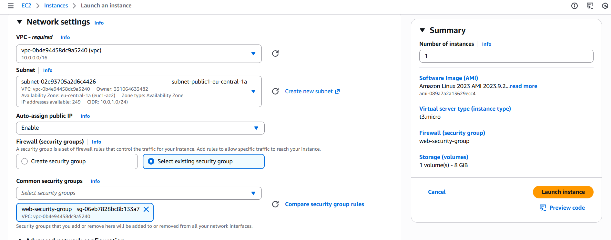

В `User data` вставляю следующий скрипт:
```
#!/bin/bash
dnf update -y
dnf install -y mariadb105
```
  
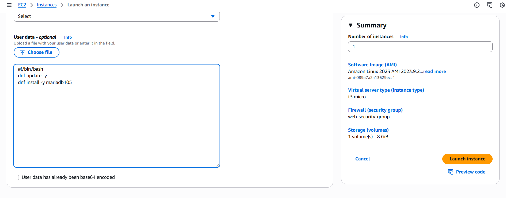
  
Подключаюсь к инстансу через командную строку, используя сетевой протокол ssh, и проверяю установлен ли mysql:

```
ssh -i lab05-key.pem ec2-user@18.193.68.58
mysql --version
```
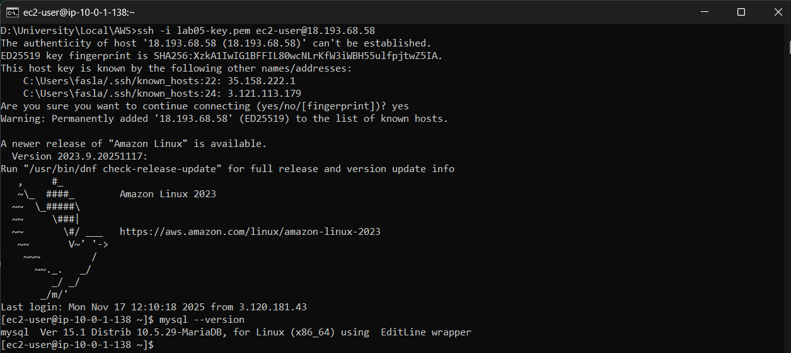

### Шаг 4. Подключение к базе данных и выполнение базовых операций

Используя endpoint ранее созданной RDS, подключаюсь к mysql и выбираю базу данных:
```
mysql -h project-rds-mysql-prod.cvs6ogqke7l8.eu-central-1.rds.amazonaws.com -u admin -p
```
  
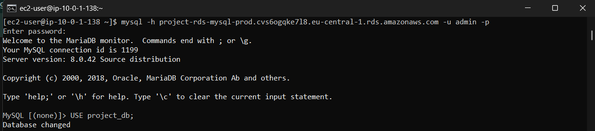
  
Создаю таблицы категорий и todos со связью 1 к many:
  
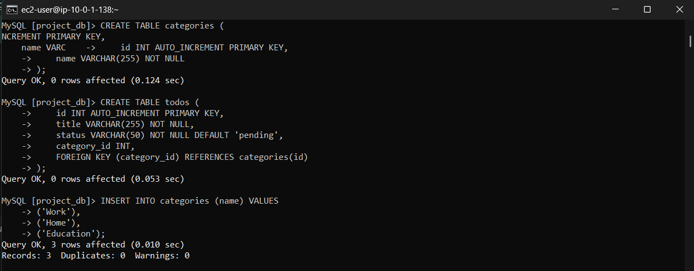

Вставляю тестовые данные в данные таблицы:
  
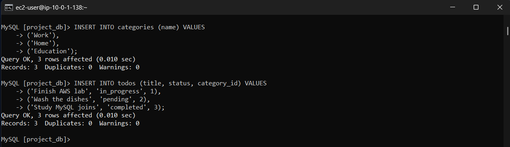

Просматриваю содержимое таблиц:
  
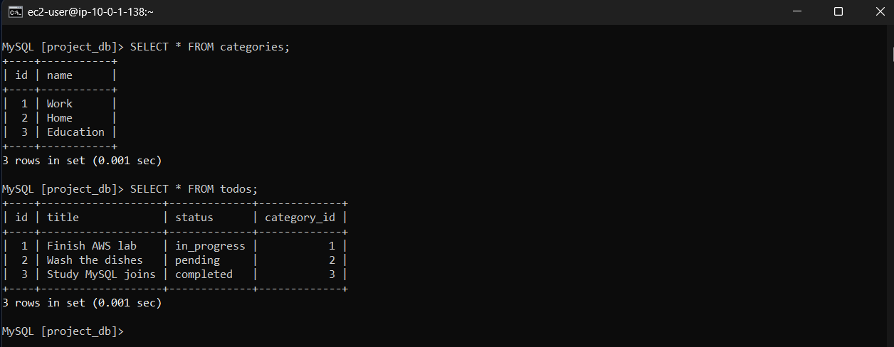

JOIN: получить задачи с названием категории:
```mysql
SELECT 
    t.id,
    t.title,
    t.status,
    c.name AS category
FROM todos t
JOIN categories c ON t.category_id = c.id;
```
  
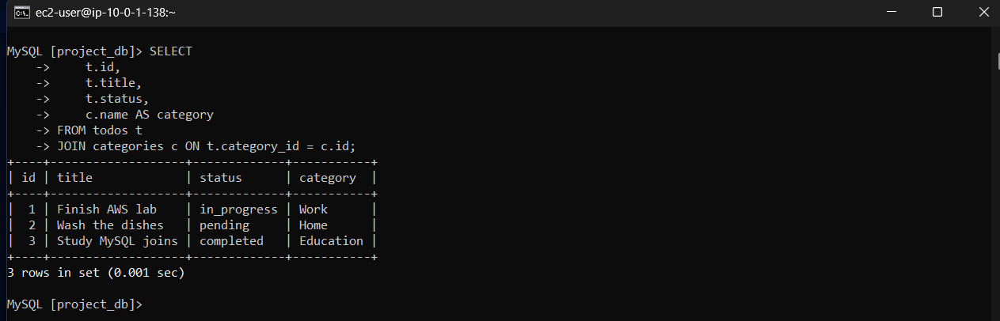

Фильтр: задачи только из категории "Work"
```mysql
SELECT t.title, t.status
FROM todos t
JOIN categories c ON t.category_id = c.id
WHERE c.name = 'Work';
```
  
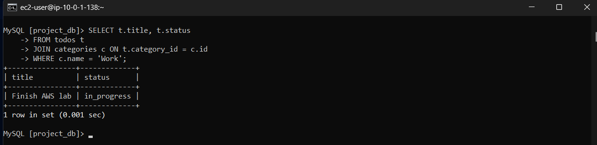


### Шаг 5. Создание Read Replica

Для создания реплики захожу `Actions` -> `Create read replica` и указываю:
- Replica Source: project-rds-mysql-prod
- DB instance identifier: project-rds-mysql-read-replica
  
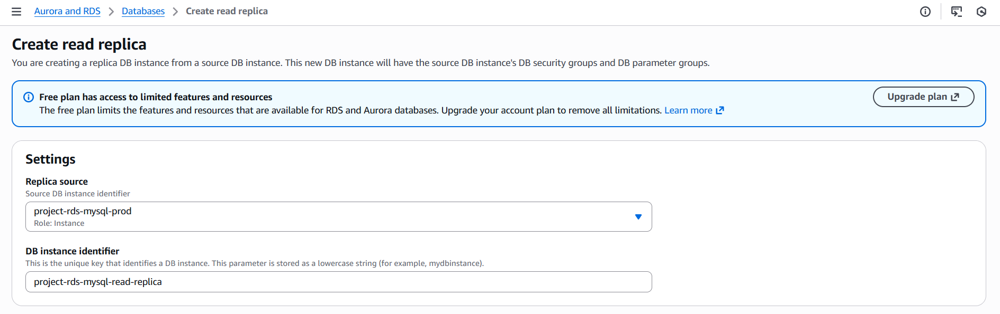

- Public access: Disable
- VPC: тот же, что у основного RDS.
  
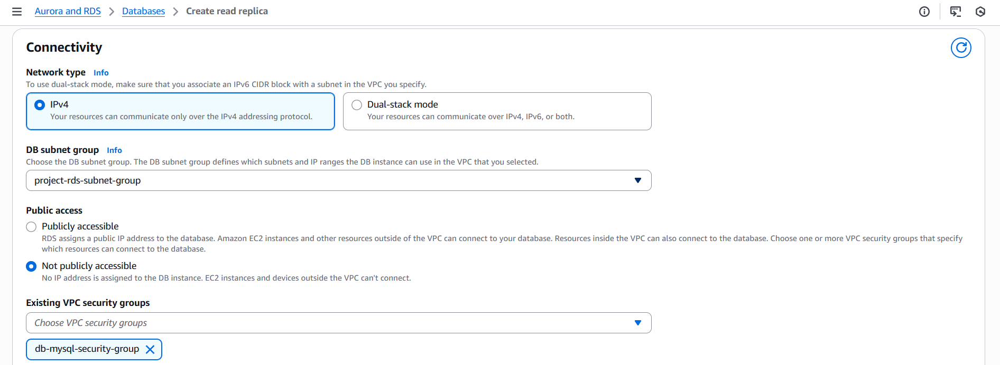

- Enhanced monitoring: Disable
  
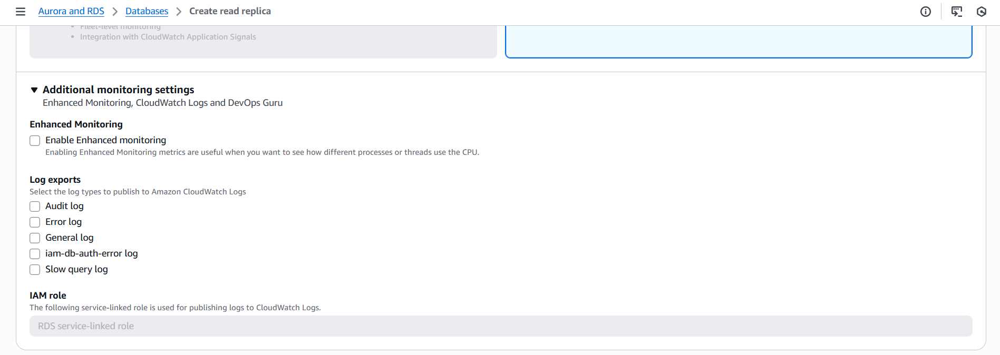

Реплика RDS успешно создана:
  
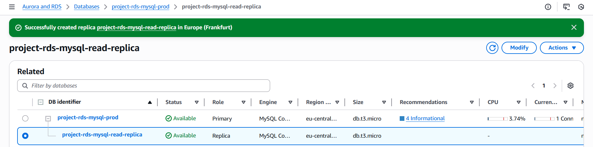

Подключаюсь к Read Replica с инстанса:
```
mysql -h project-rds-mysql-read-replica.cvs6ogqke7l8.eu-central-1.rds.amazonaws.com -u admin -p  
```
  
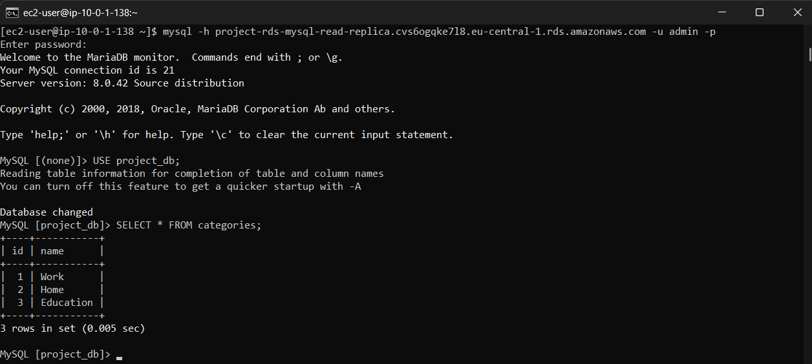

 > **Какие данные вы видите? Объясните почему.** Я вижу все те же данные, что и в основной базе, потому что read replica — это точная копия основного RDS, которая постоянно синхронизируется с него через репликацию.

Пробую выполнить INSERT на реплике:
```
INSERT INTO categories (name) VALUES ('Replica test');
```
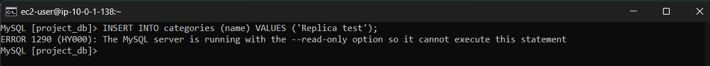
 > **Получилось ли выполнить запись на Read Replica? Почему?** Запись сделать нельзя, потому что read replica — только для чтения, mysql rds блокирует любые изменения, чтобы не нарушать механизм репликации.

На основном RDS добавляю записи в таблицу:
  
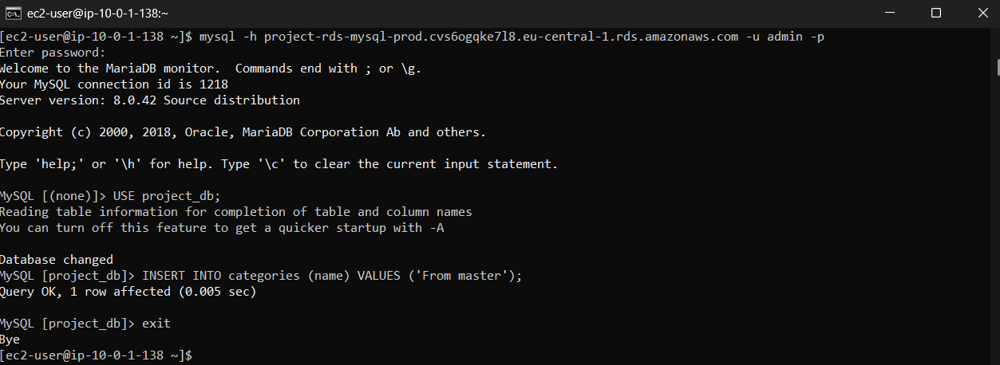

Затем на реплике проверяю результат:
  
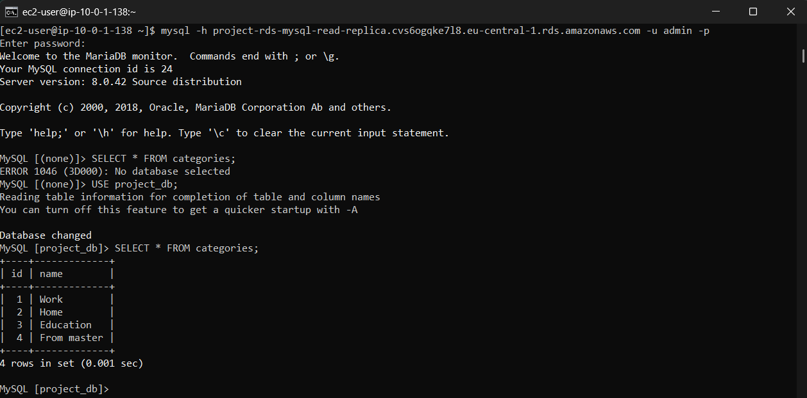
  
 > **Отобразилась ли новая запись на реплике? Объясните почему.** Новая запись появится, потому что read replica автоматически получает все изменения с основного экземпляра через асинхронную репликацию.

**Зачем нужны Read Replicas и когда они полезны:** 
- Разгрузки основной базы. Чтение перенаправляется на реплики -> основная база не перегружена запросами.
- Ускорения чтения. Можно держать реплики в разных регионах - пользователи ближе -> меньше задержка.
- Аналитика и отчёты. Отчётам не мешает рабочая база, так как чтение идёт с реплики.
  
Но нельзя использовать реплики для записи - потому что они read-only.


 ### 6a. Развертывание CRUD приложения

Копирую созданное CRUD приложение со своей машины(шучу, у меня даже велосипеда нет) на виртуальную:
```
scp -i lab05-key.pem -r D:\University\Local\AWS\crudapp ec2-user@18.193.68.58:/home/ec2-user/
```
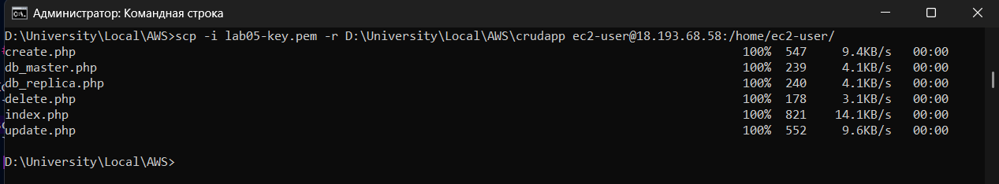

Устанавливаю Apache:
```
sudo dnf install -y httpd
```
Запускаю и включаю автозапуск:
```
sudo systemctl start httpd
sudo systemctl enable httpd
```
Проверяю:
```
systemctl status httpd
```
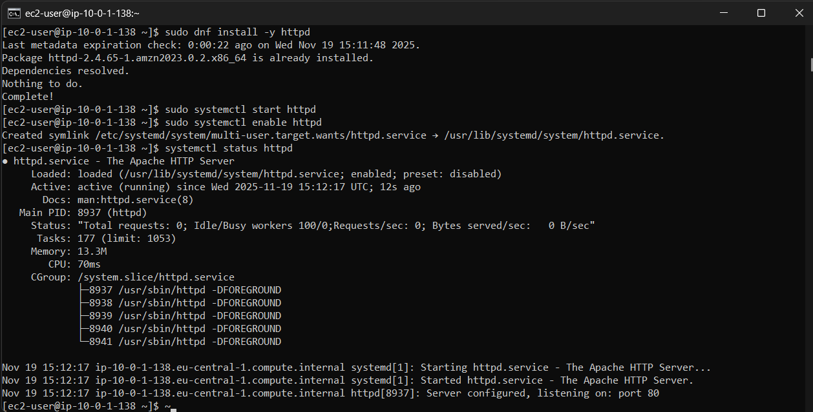

Копирую проект по пути `/var/www/html/` и даю права:
```
sudo cp -r crudapp /var/www/html/
sudo chown -R apache:apache /var/www/html/crudapp
sudo chmod -R 755 /var/www/html/crudapp
```
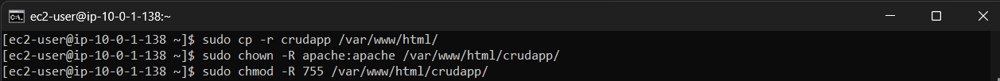

Перехожу по URL `http://18.193.68.58/crudapp/index.php` и проверяю работоспособность проекта:
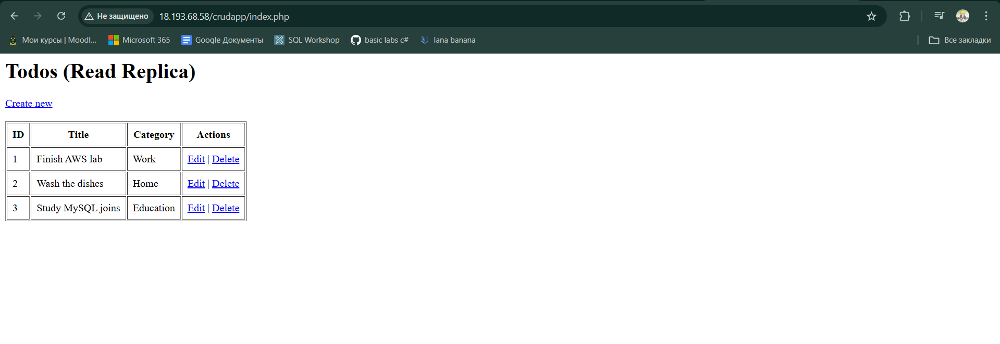

## Вывод

В ходе лабораторной работы было развернуто веб-приложение CRUD на сервере Amazon EC2 и выполнено подключение к базе данных Amazon RDS. Было настроено разделение нагрузки: операции чтения выполнялись через Read Replica, а операции записи — через основной (master) экземпляр. Приложение было перенесено на сервер, настроен Apache и проверено корректное подключение к базе. В процессе были выявлены и исправлены ошибки конфигурации, после чего приложение успешно заработало.

## Билиография
- https://elearning.usm.md/mod/assign/view.php?id=320200
- https://eu-central-1.console.aws.amazon.com/ec2/home?region=eu-central-1#Overview:
- https://eu-central-1.console.aws.amazon.com/rds/home?region=eu-central-1#
- https://eu-central-1.console.aws.amazon.com/vpcconsole/home?region=eu-central-1#vpcs: