# Лабораторная работа №5. Облачные базы данных. Amazon RDS, DynamoDB

## Цель
Целью работы является ознакомиться с сервисами Amazon RDS (Relational Database Service) и Amazon DynamoDB, а также научиться:
- Создавать и настраивать экземпляры реляционных баз данных в облаке AWS с использованием Amazon RDS.
- Понимать концепцию Read Replicas и применять их для повышения производительности и отказоустойчивости баз данных.
- Подключаться к базе данных Amazon RDS с виртуальной машины EC2 и выполнять базовые операции с данными (создание, чтение, обновление, удаление записей - CRUD).
- (Дополнительно) Ознакомиться с сервисом Amazon DynamoDB и освоить работу с хранением данных в NoSQL-формате.

## Ход работы

### Шаг 1. Подготовка среды (VPC/подсети/SG)

Находясь в AWS Console, перехожу в `VPC` и создаю `VPC and more` с двумя публичными и двумя приватными подсетями. Заполняю настройки: 
- VPC name: project-vpc
- IPv4 CIDR: 10.0.0.0/16  
  
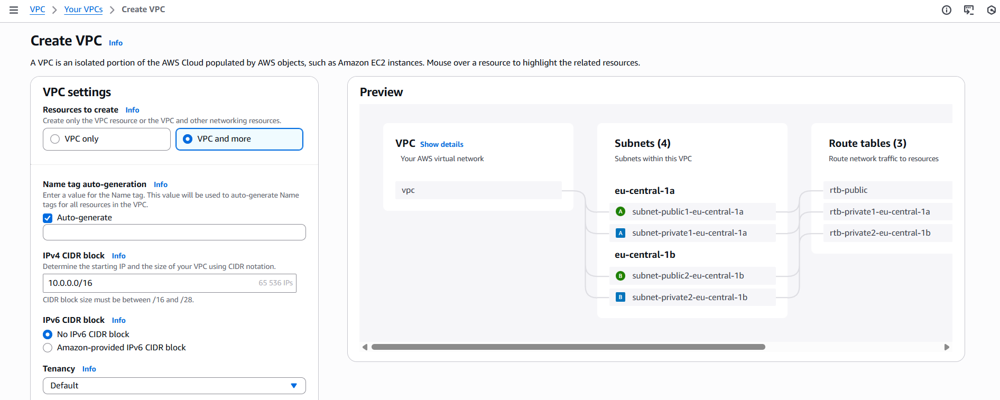
  
- Number of AZs: 2
- Public subnets: 2
- Private subnets: 2
- Subnet CIDR:
    - 10.0.1.0/24 - public AZ1
    - 10.0.2.0/24 - public AZ2
    - 10.0.3.0/24 - private AZ1
    - 10.0.4.0/24 - private AZ2
- NAT gateways: 1 per AZ  
  
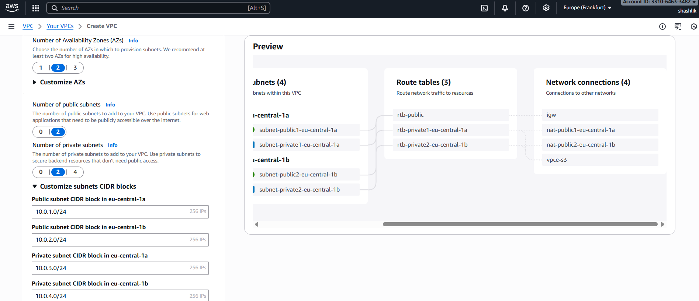
  
VPC со всеми необходимыми подсетями успешно создан:  
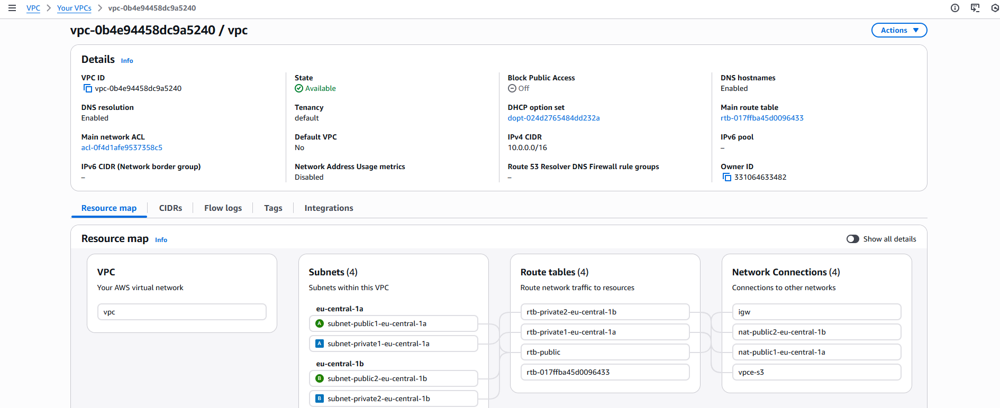
  
Далее захожу в `EC2` -> `Security Groups` и создаю группу, заполняя следующие пункты:
- Name: web-security-group
- VPC: project-vpc

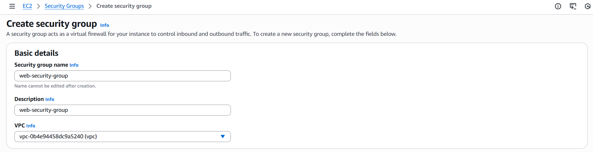
- Inbound Rules
    - HTTP (порт 80) от любого источника;
    - SSH (порт 22) от моего IP-адреса;
- Outbound Rules
    - Custom TCP -> Anywhere;

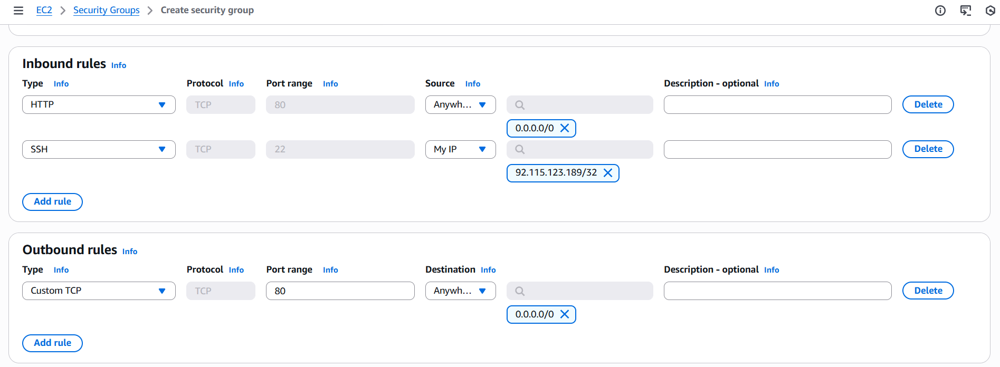
  
Затем создаю еще одну `Security Group`:
- Name: db-mysql-security-group
- VPC: project-vpc
  
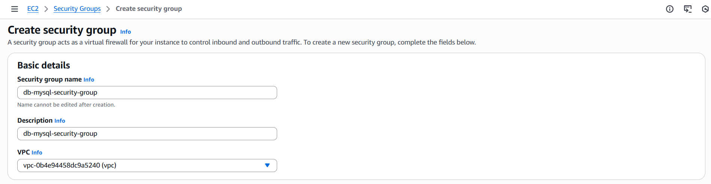
- Inbound Rules:
    - MySQL/Aurora (порт 3306) от web-security-group;
- Outbound Rules:
    - All traffic -> Anywhere;
  
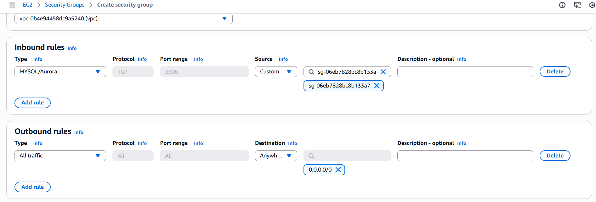
  
Меняю "web-security-group", добавляя дополнительное правило для исходящего трафика:
- Outbound Rules:
    - MySQL/Aurora (порт 3306) к db-mysql-security-group

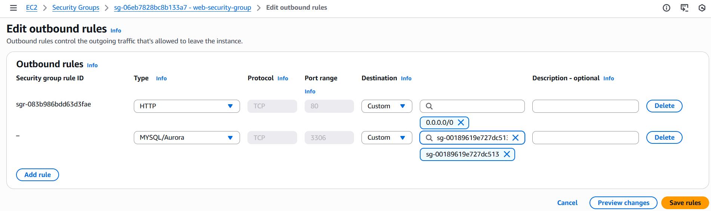
  
---
  
### Шаг 2. Развертывание Amazon RDS

 > **Что такое Subnet Group? И зачем необходимо создавать Subnet Group для базы данных?** Subnet Group - это набор приватных подсетей в одном VPC, из которых RDS выбирает сеть, где будет размещена база данных. Она нужна, чтобы база работала только в приватных подсетях и была недоступна из интернета.
  
Перехожу в сервис `Aurora and RDS.` -> `Subnet groups` и нажимаю `Create DB subnet group`. Заполняю поля:
- Name: project-rds-subnet-group
- VPC: project-vpc
  
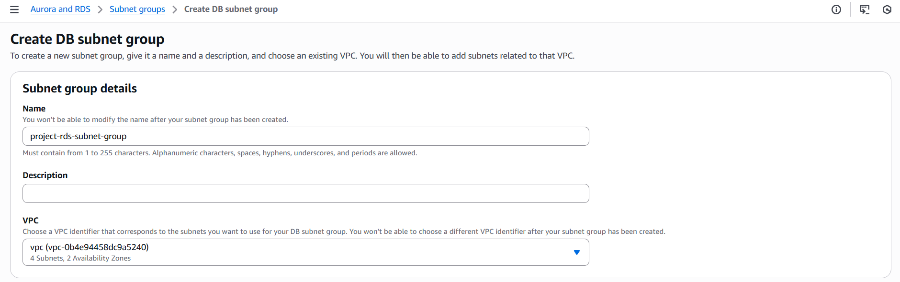
  
Добавляю 2 приватные подсети из 2 разных AZ:  
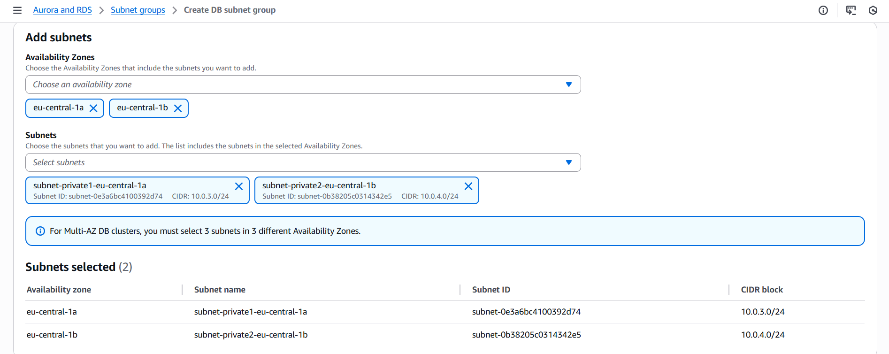

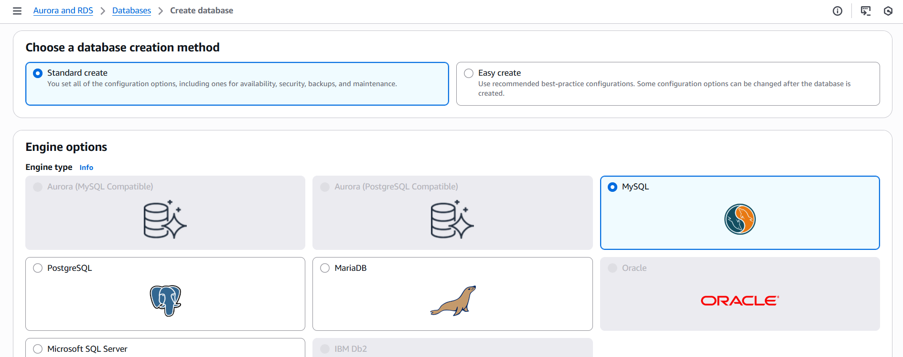

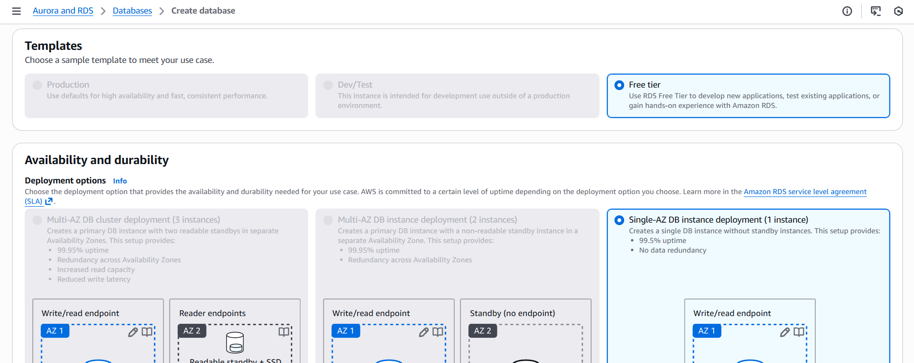
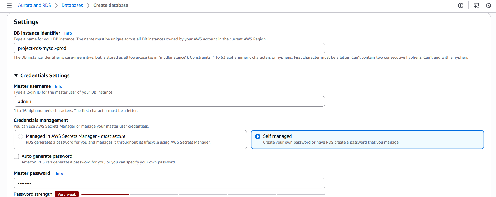
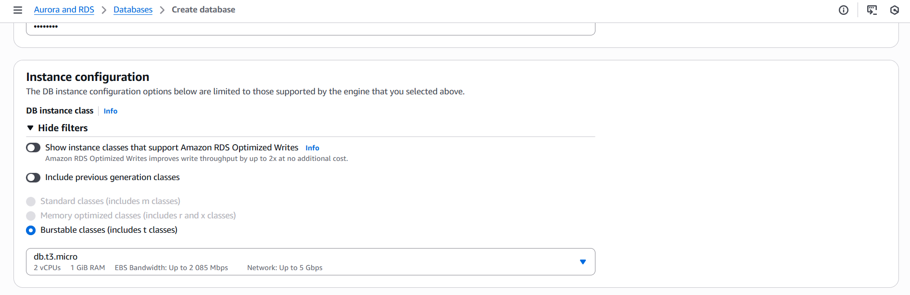
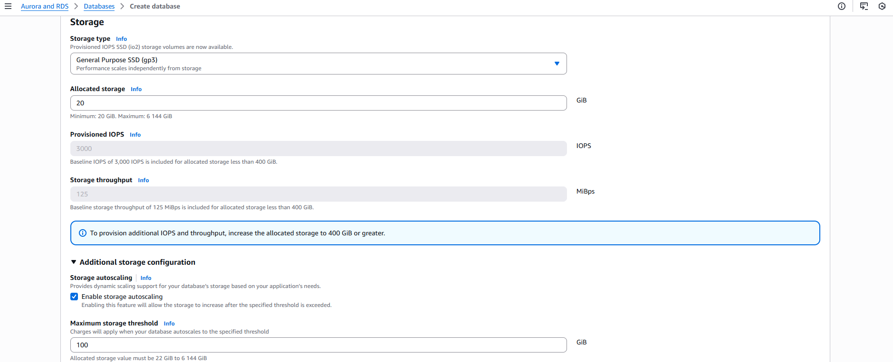
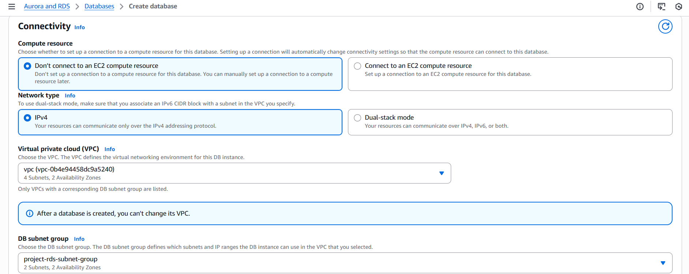
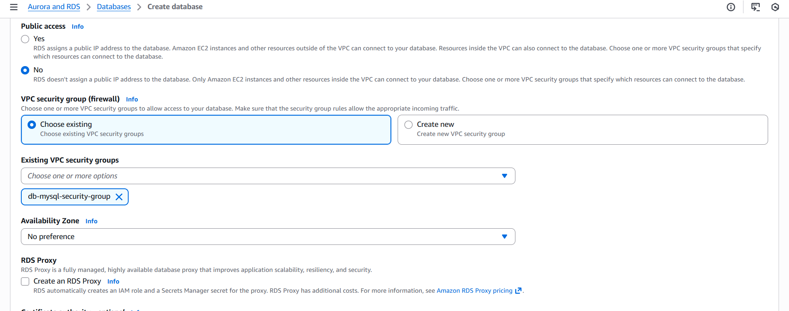
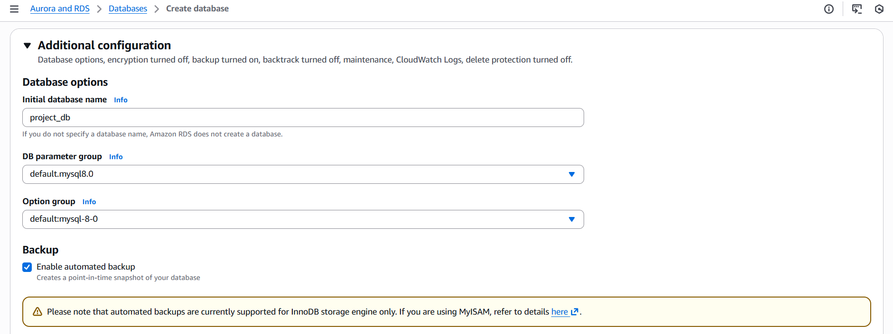
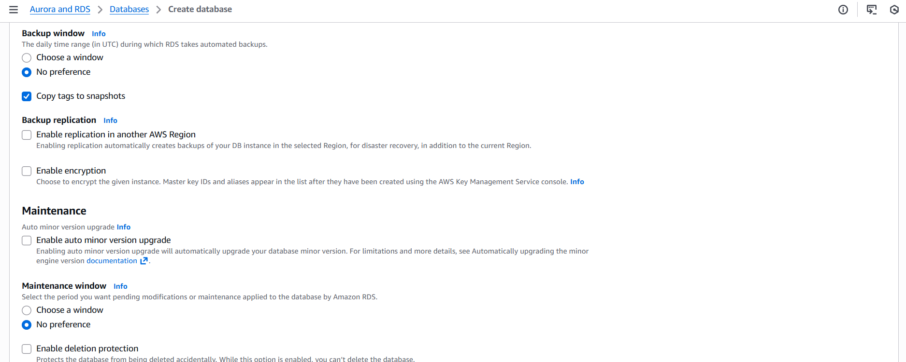
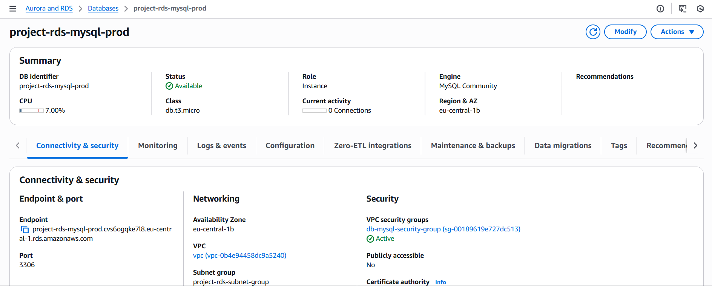