# Лабораторная работа №6. Балансирование нагрузки в облаке и авто-масштабирование

## Цель работы
Закрепить навыки работы с AWS EC2, Elastic Load Balancer, Auto Scaling и CloudWatch, создав отказоустойчивую и автоматически масштабируемую архитектуру.

Студент развернёт:

VPC с публичными и приватными подсетями;
Виртуальную машину с веб-сервером (nginx);
Application Load Balancer;
Auto Scaling Group (на основе AMI);
нагрузочный тест с использованием CloudWatch.

## Ход работы

### Шаг 1. Создание VPC и подсетей

Использую созданную в прошлой лабораторной сеть, с двумя публичными подсетями и двумя приватными, где уже подключен интернет-шлюз:
  
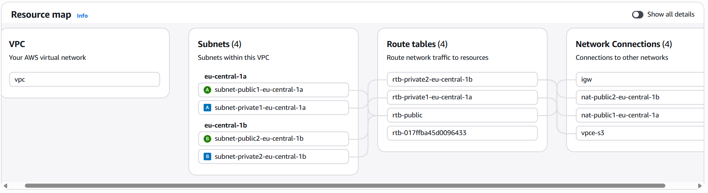

### Шаг 2. Создание и настройка виртуальной машины

Начинаю настройку инстанса, следуя следующим пунктам:
 - AMI: Amazon Linux 2
 - Тип: t3.micro
 - VPC: созданный в первом шаге
  
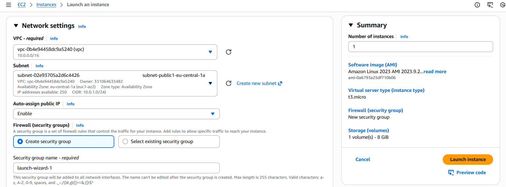

 - Входящие правила Security Group:
  - SSH (порт 22) — источник: ваш IP
  - HTTP (порт 80) — источник: 0.0.0.0/0
 - Исходящие правила Security Group:
  - Все трафики — источник: 0.0.0.0/0
  
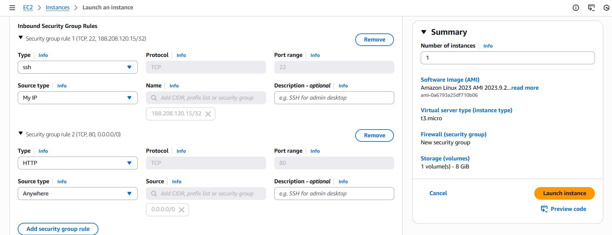

 - Advanced Details -> Detailed CloudWatch monitoring: Enable
  

 - User data: скрипт [init.sh](https://github.com/MSU-Courses/cloud-computing/blob/main/_lab/06_Cloud_Load_Balancer_And_AutoScalig/scripts/init.sh)
  
 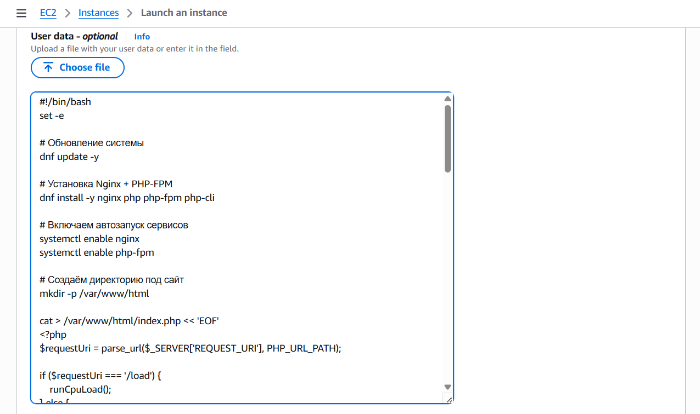

Жду окончательного запуска виртуальной машины и перехожу по публичному айпи адресу для проверки работоспобности:
  
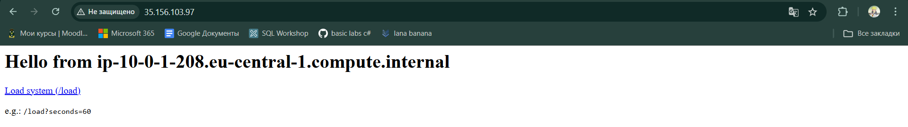

### Шаг 3. Создание AMI

В EC2 выбираю `Instance` -> `Actions` -> `Image and templates` -> `Create image`, ввожу название образа, а все остальные настройки оставляю по умолчанию:
  
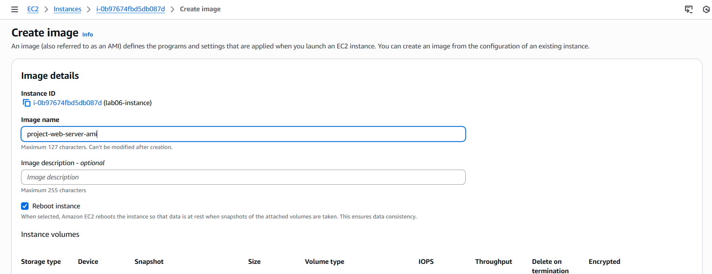 
  
 > **Что такое image (AMI)?** AMI - это готовый шаблон виртуальной машины, в котором уже есть операционная система, настройки и установленные программы. Он позволяет быстро запускать новые одинаковые EC2-инстансы.
   
 > **Чем AMI отличается от snapshot?** Snapshot - это копия только диска (данных), а AMI - полный образ сервера, который может включать один или несколько snapshot и используется для запуска новых машин.
   
 > **Какие есть варианты использования AMI?** AMI используют для авто-масштабирования, быстрого восстановления серверов, клонирования одинаковых машин и развёртывания окружений по шаблону.

Жду пока созданный образ появится в списке `AMIs`:
  
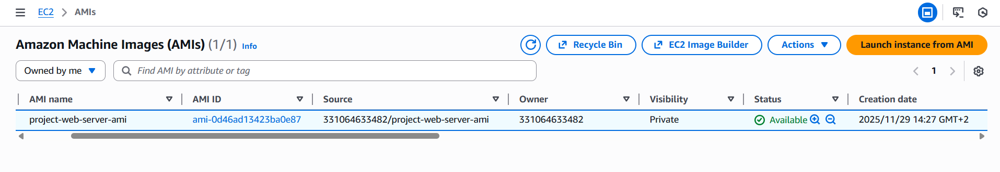

### Шаг 4. Создание Launch Template

В разделе EC2 выбираю `Launch Templates` → `Create launch template`. Указываю следующие параметры:
 - Название: project-launch-template
    
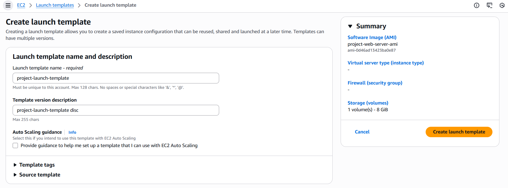
  
 - AMI: выбираю созданную ранее AMI
  
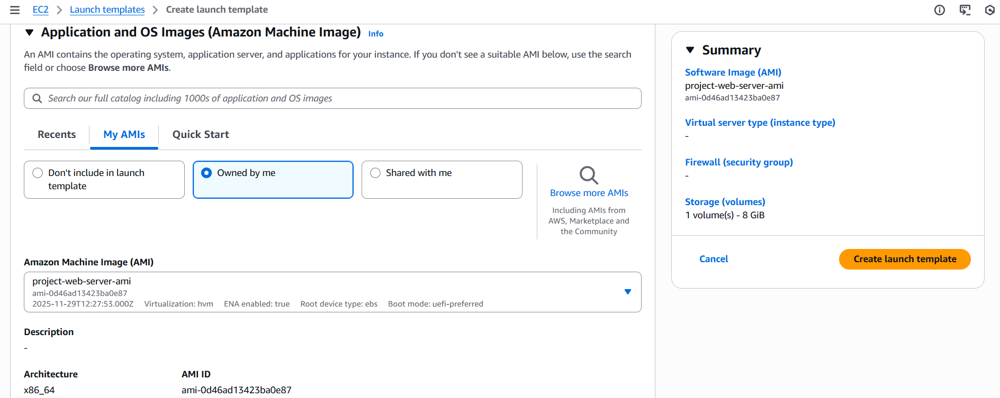
   
 - Тип инстанса: t3.micro
 - Key pair: точно такой же как в инстансе
  
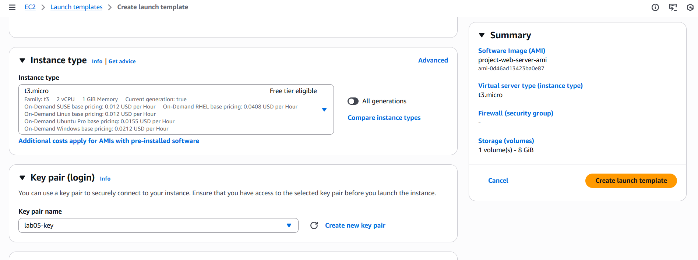
  
 - Security groups: выберите ту же группу безопасности, что и для виртуальной машины
  
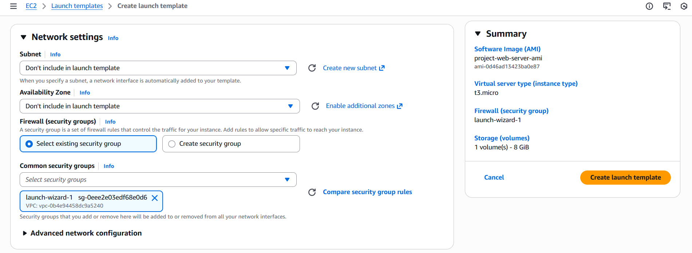
  
В разделе `Advanced details` -> `Detailed CloudWatch monitoring` выбираю Enable, для того чтобы собирать дополнительные метрики для Auto Scaling:
  

 > **Что такое Launch Template и зачем он нужен? Чем он отличается от Launch Configuration?** Launch Template - это шаблон, в котором заранее указаны AMI, тип инстанса, сеть, ключи доступа, UserData и параметры мониторинга. Он нужен чтобы новые серверы всегда разворачивались одинаковыми, без ручной настройки. Auto Scaling использует Launch Template для автоматического создания и замены инстансов. Launch Configuration - старый, устаревший механизм, а Launch Template - новый, гибкий и поддерживает версии, дополнительные параметры и обновлённые функции AWS.

### Шаг 5. Создание Target Group

В разделе EC2 выбираю `Target Groups` → `Create target group`. Указываюе следующие параметры:
 - Target type: Instances
 - Target group name: project-target-group
  
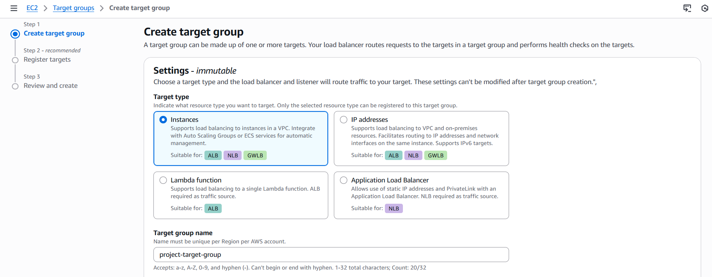 
  
 - Протокол: HTTP
 - Порт: 80
 - VPC: раннее созданная VPC
  
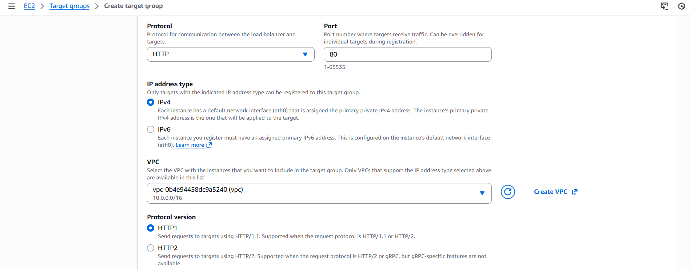

 > **Зачем необходим и какую роль выполняет Target Group?** Target Group - это список серверов (EC2), к которым балансировщик будет отправлять трафик. Он проверяет состояние инстансов с помощью health-check и направляет запросы только на здоровые машины.

### Шаг 6. Создание Application Load Balancer

В разделе EC2 выбираю `Load Balancers` → `Create Load Balancer` → `Application Load Balancer`. Указываю следующие параметры:
 - Load balancer name: project-alb
 - Scheme: Internet-facing.
  
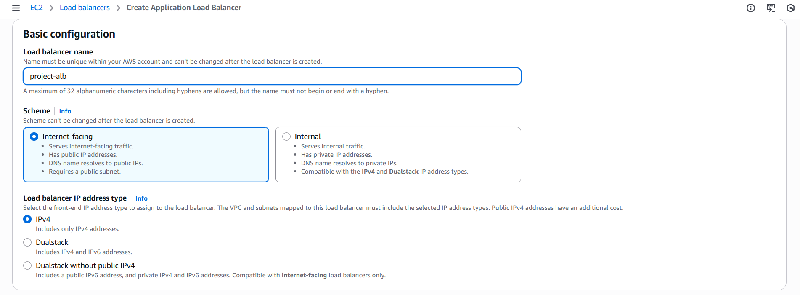

 > **В чем разница между Internet-facing и Internal?** Internet-facing ALB - имеет публичный IP и доступен из интернета. Используется для сайтов и публичных API. Internal ALB - не имеет публичного IP и доступен только внутри VPC. Используется для внутренних сервисов.

 - Subnets: выбираю созданные 2 публичные подсети.
  
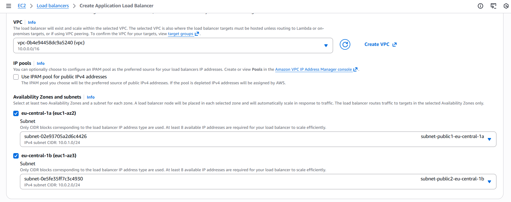
  
 - Security Groups:  та же группа безопасности, что и для виртуальной машины
 - Listener: протокол HTTP, порт 80.
  
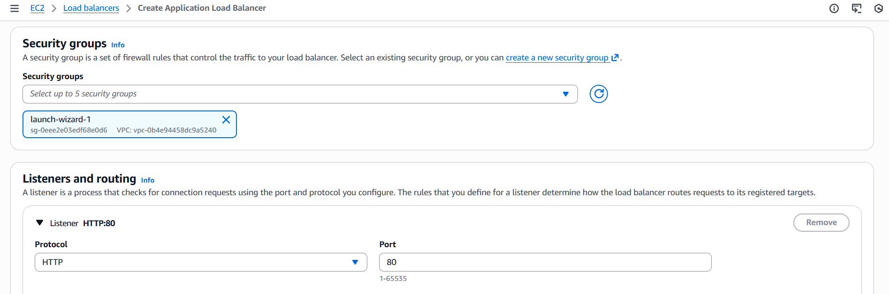

 - Default action: project-target-group
  
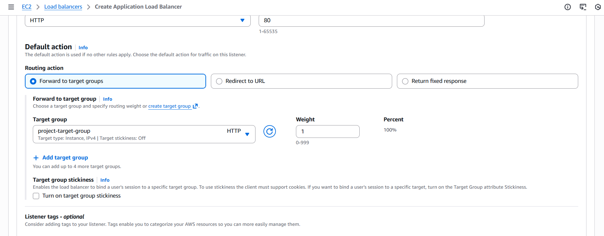

 > **Что такое Default action и какие есть типы Default action?** Default action - это действие, которое Listener выполняет, если входящий HTTP-запрос не подходит ни под одно правило. Типы Default Action: 1. Forward -> направить в Target Group (самое популярное); 2. Redirect -> перенаправить (например, с HTTP на HTTPS); 3. Return fixed response -> вернуть фиксированный ответ (например, 404 или кастомный текст).
  
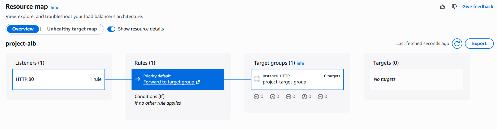
  
### Шаг 7. Создание Auto Scaling Group

В разделе EC2 выбираю `Auto Scaling Groups` → `Create Auto Scaling group`. Указываю следующие параметры:
 - Auto Scaling group name: project-auto-scaling-group
 - Launch template: project-launch-template
  
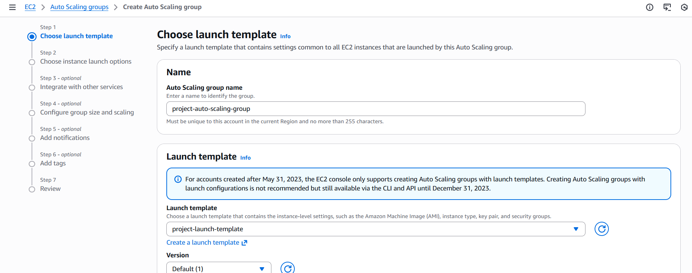
  
 - Network: раннее созданная VPC и две приватные подсети

 > **Почему для Auto Scaling Group выбираются приватные подсети?** Потому что инстансы Auto Scaling должны быть недоступны напрямую из интернета, их трафик проходит через Load Balancer, а не напрямую. Это безопаснее и правильная архитектура AWS.

 - Availability Zone distribution: Balanced best effort

 > **Зачем нужна настройка: Availability Zone distribution?** Эта настройка нужна, чтобы Auto Scaling равномерно распределял инстансы по двум зонам доступности. Если одна зона упадет, сервис продолжит работать.
  
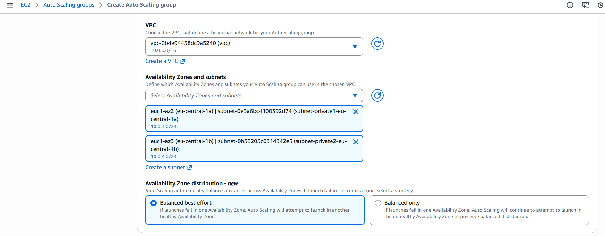

 - Integrate with other services: Attach to an existing load balancer
 - Target Group: project-target-group
  
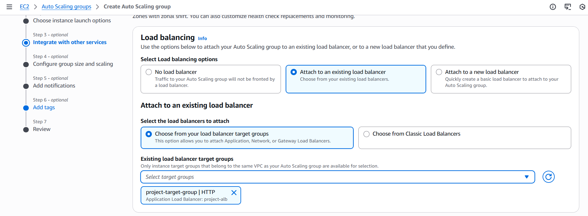

- Configure group size and scaling:
 - Desired capacity: 2
 - Minimum capacity: 2
 - Maximum capacity: 4
  
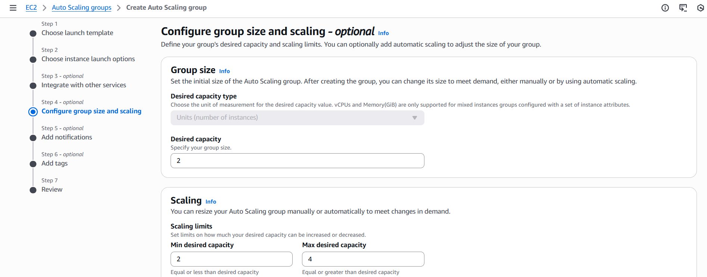

 - Target tracking policy
 - Metric type: Average CPU utilization
 - Target value: 50
 - Instance warmup: 60 sec
  
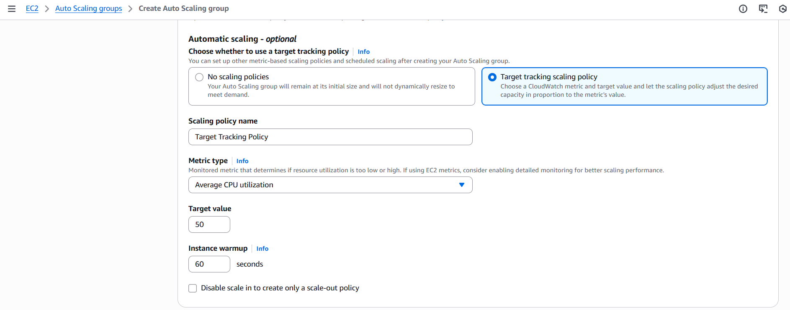

 > **Что такое Instance warm-up period и зачем он нужен?** Warm-up - это время, которое даётся новому инстансу, чтобы полностью запуститься, включить Nginx, пройти health-check и начать работать. Пока warm-up не закончился, Auto Scaling не учитывает его нагрузку в расчётах, чтобы не масштабироваться преждевременно.

 - Monitoring: Enable group metrics collection within CloudWatch
  
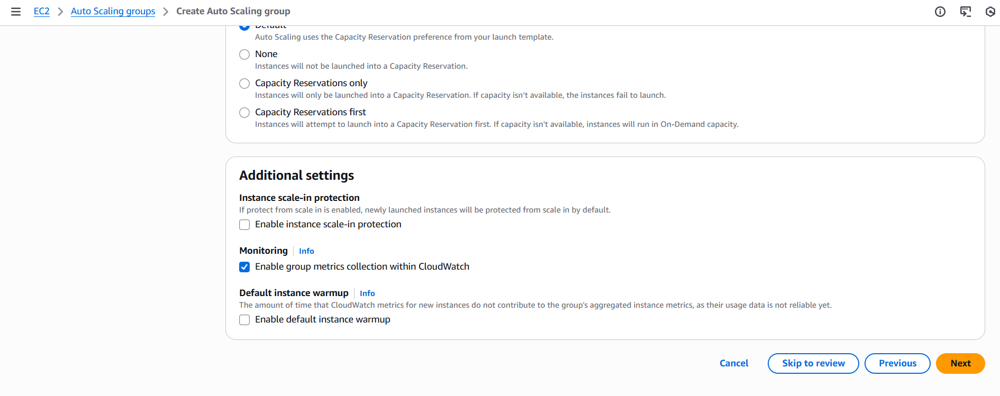

### Шаг 8. Тестирование Application Load Balancer

Перехожу в раздел `EC2` -> `Load Balancers`, выбираю созданный `Load Balancer`, копирую его DNS-имя и вставляю в адресную строку:
  
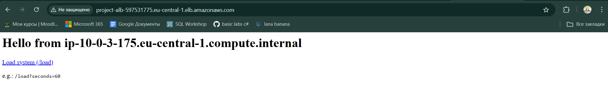  
  
  > **Какие IP-адреса вы видите и почему?** Появляются IP-адреса приватных EC2-инстансов, которые находятся в Auto Scaling Group, потому что инстансы находятся в приватных подсетях, у них нет публичных IP, и общение с ALB идёт по внутренней сети VPC.
  

### Шаг 9. Тестирование Auto Scaling

Перехожу в `CloudWatch` -> `Alarms`, где были созданы автоматические оповещения для Auto Scaling Group.
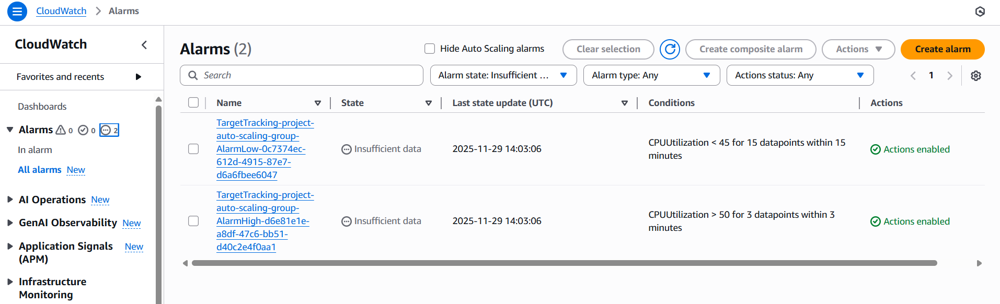
  
Просматриваю оповещение `TargetTracking-project-auto-scaling-group-AlarmHigh`:
  
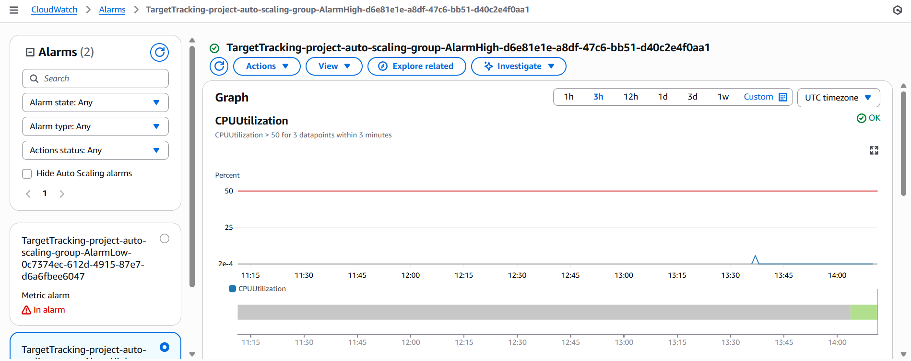

Открываю 7 вкладок `http://project-alb-597531775.eu-central-1.elb.amazonaws.com/load?seconds=60` и возвращаюсь назад к графику, через пару минут увеличился рост нагрузки:
  
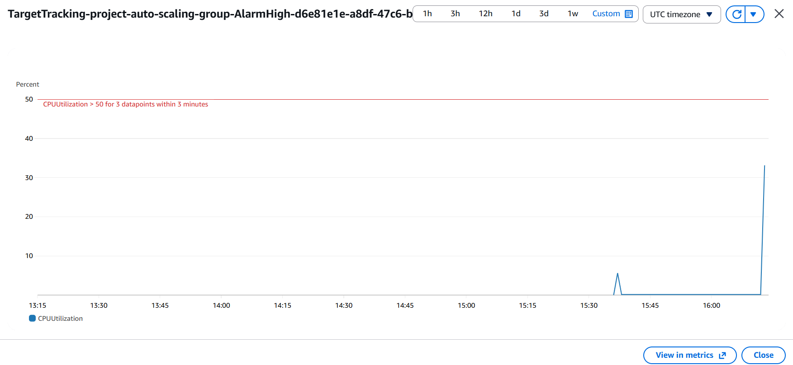

Далее видим, что сработало второе оповещение `TargetTracking-project-auto-scaling-group-AlarmLow`:
  
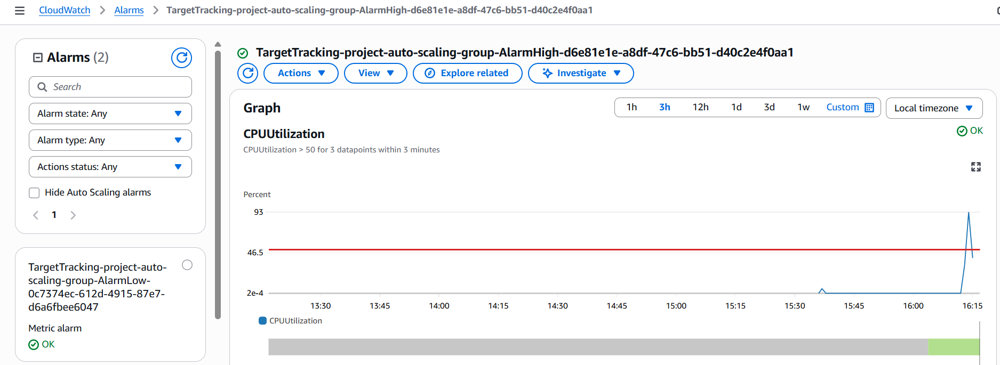
  
Перехожу в раздел `EC2` -> `Instances` и смотрю на количество запущенных инстансов:
  
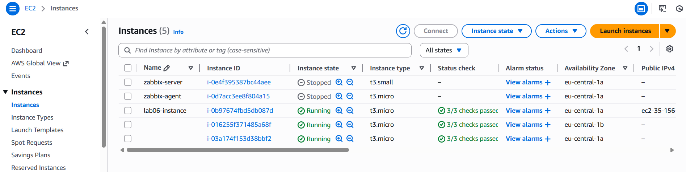
  

 > **Какую роль в этом процессе сыграл Auto Scaling?** Auto Scaling следил за загрузкой CPU инстансов и, когда нагрузка превысила заданный порог (50%), автоматически создал новые виртуальные машины, чтобы выдержать повышенный трафик. Он увидел Alarm от CloudWatch, понял, что текущих серверов недостаточно, и добавил дополнительные инстансы в группу без вмешательства.

### Шаг 10. Завершение работы и очистка ресурсов

ЧИСТКА ТОТАЛ

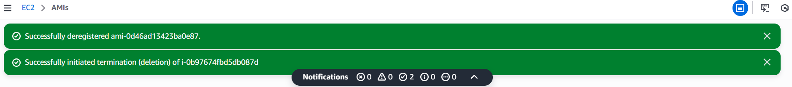

## Вывод
В лабораторной работе была настроена отказоустойчивая архитектура в AWS. Созданы VPC с подсетями, виртуальная машина с nginx, Application Load Balancer и Auto Scaling Group на основе AMI. Произведено нагрузочное тестирование через CloudWatch, после чего проверена работа балансировки и авто-масштабирования. В конце все ресурсы были удалены для исключения лишних затрат.

## Источники
- https://elearning.usm.md/mod/assign/view.php?id=322113
- https://eu-central-1.console.aws.amazon.com/vpcconsole/home?region=eu-central-1#Home:
- https://eu-central-1.console.aws.amazon.com/ec2/home?region=eu-central-1#Overview:
- https://eu-central-1.console.aws.amazon.com/cloudwatch/home?region=eu-central-1#home:
