## Лабораторная работа №2. Введение в WordPress

### Цель работы
Научиться устанавливать WordPress в локальной среде, осваивать админ-панель, изменять внешний вид сайта через темы и расширять его функциональность с помощью плагинов.

### Ход работы

#### Шаг 1. Подготовка среды

Запускаю `XAMPP` и включаю модули "Apache" и "MySQL":  
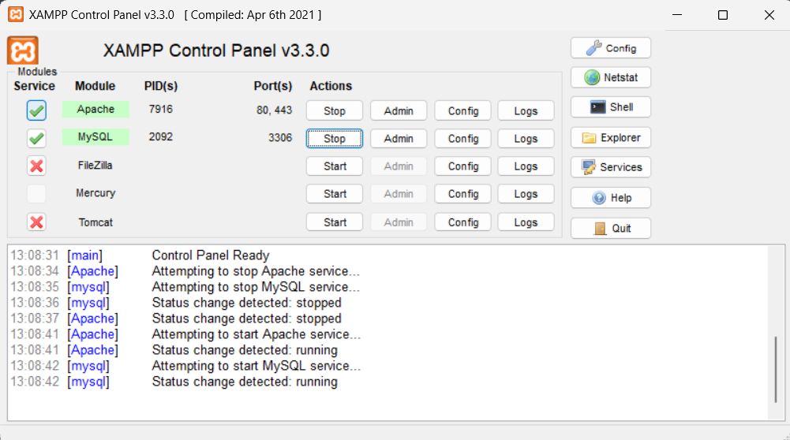
  
Далее в `phpMyAdmin` создаю базу данных с таблицами:  
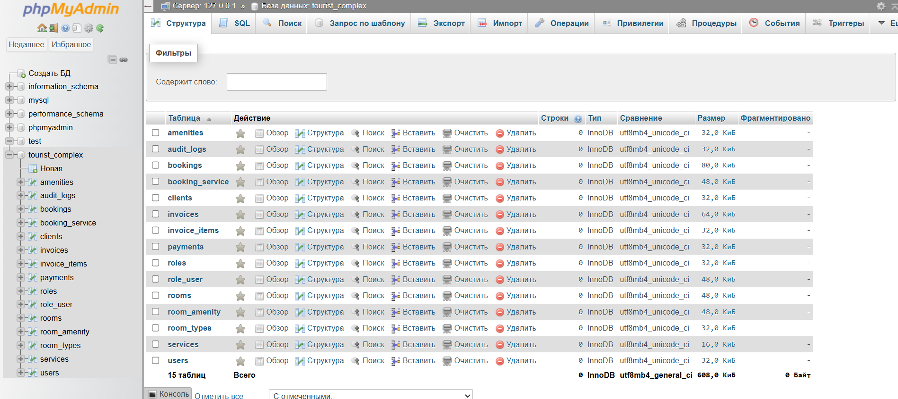
  
---
  
#### Шаг 2. Установка WordPress

Захожу на официальный сайт `WordPress` и скачиваю зипчик:  
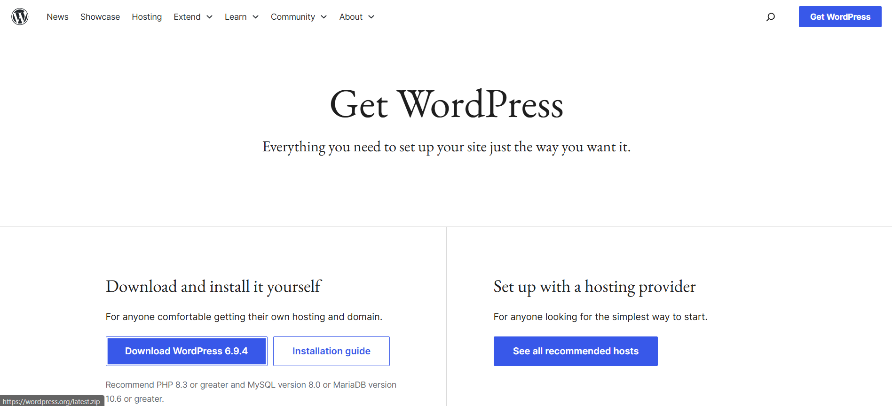
  
Распаковываю архив в папку "htdocs" в директории `XAMPP`:  
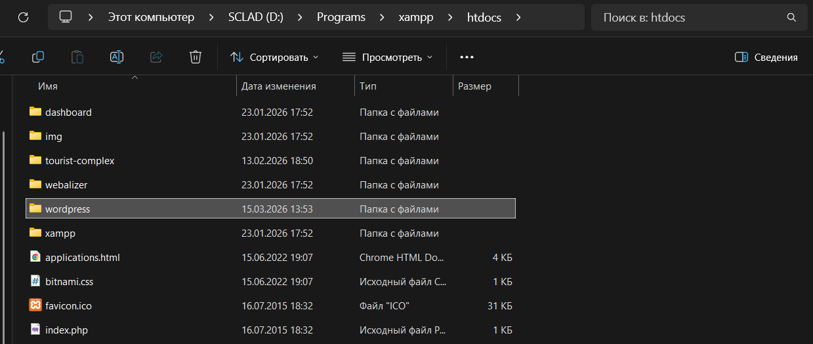
   
Перехожу по URL `http://localhost/wordpress` и прохожу процесс установки:
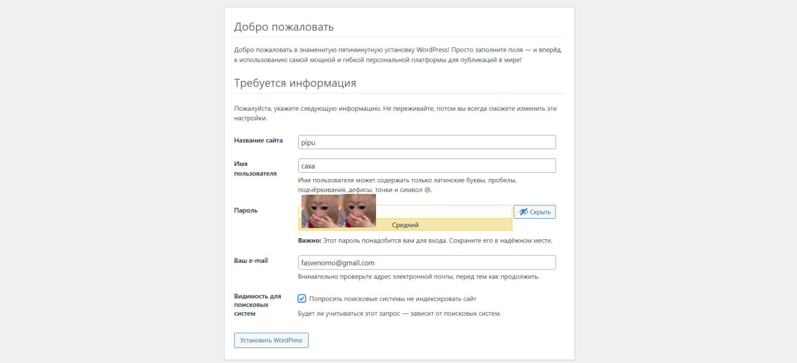  
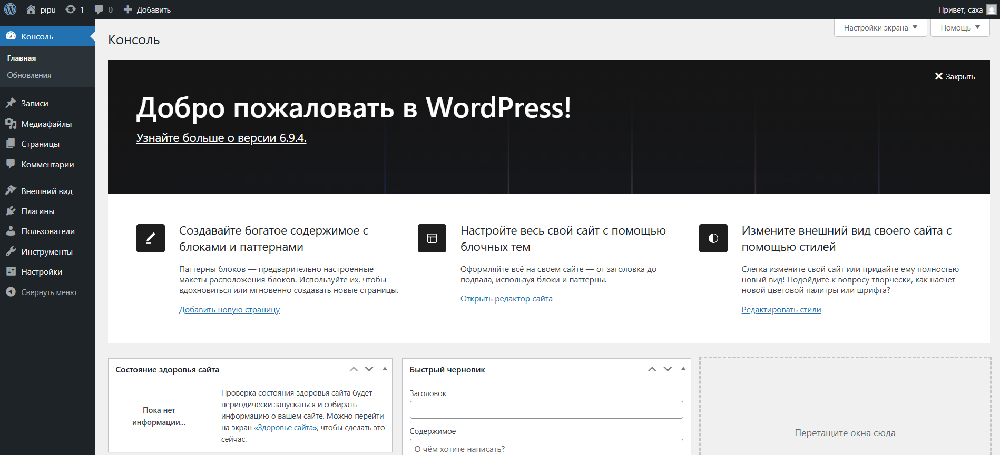
  
---
  
#### Шаг 3. Первоначальные настройки сайта

В админ-панели перехожу в раздел `Settings` → `General`. Меняю название сайта:  
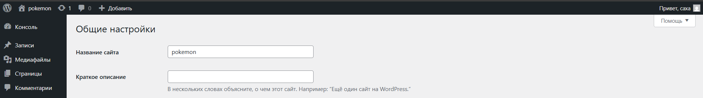
  
И есчо часовой пояс меняю:  
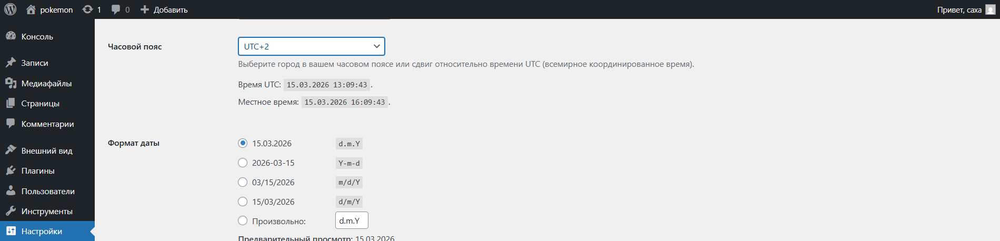
  
В разделе `Settings` → `Permalinks` устанавливаю вариант Post name для удобных ссылок:  
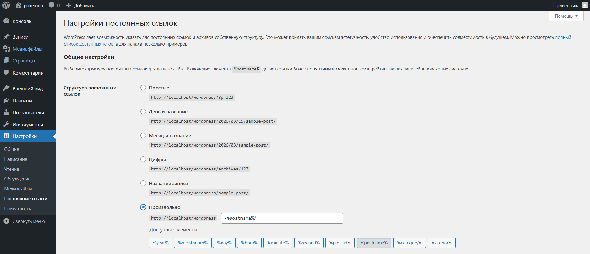
  
---
  
#### Шаг 4. Работа с темами

Открываю раздел `Appearance` → `Themes`, устанавливаю новую темы из офф каталога и активирую:  
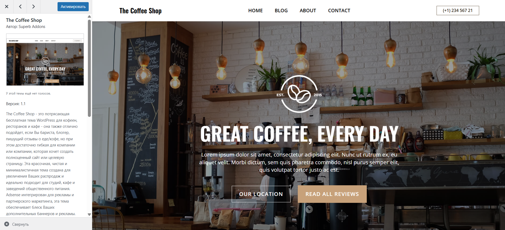
  
В меню `Appearance` → `Customize` настраиваю логотип сайта, цветовую схему и заголовок с описанием:  
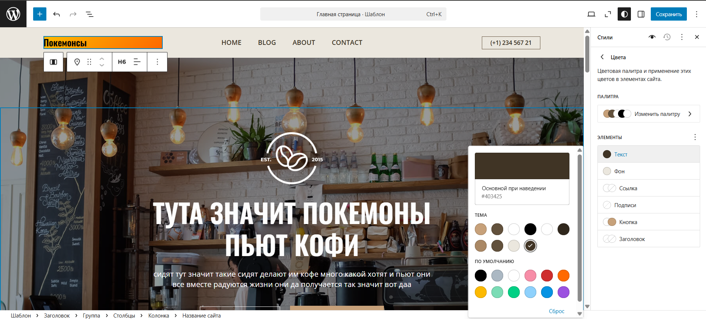
  
---
  
#### Шаг 5. Работа с плагинами

В разделе `Plugins` добавляю два плагина "Classic Editor" и "Contact Form 7":  
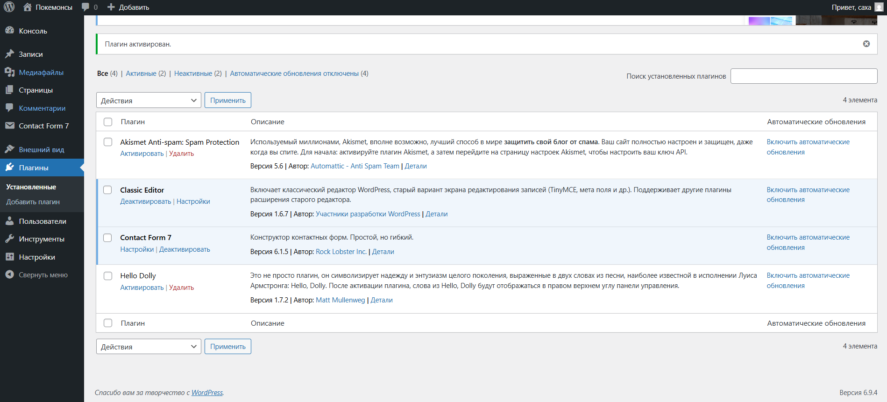
  
Создаю форму через "Contact Form 7":  
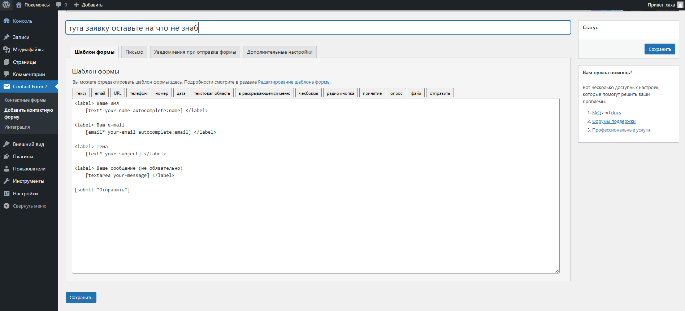
  
И добавляю запись через обновленный интерфейс "Classic Editor":  
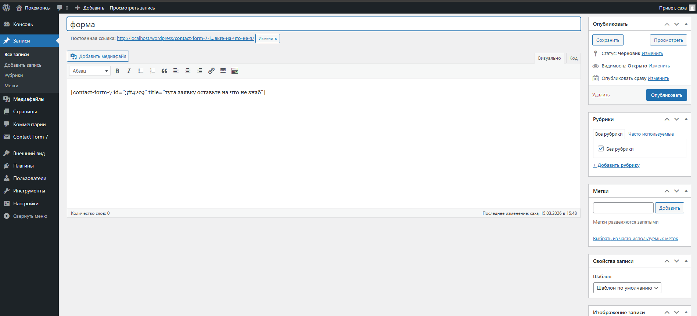
  
После деактивации плагинов "Contact Form 7" пропадает соответствующий раздел в панеле WordPress и "Classic Editor" меняется интерфейс создания записи:  
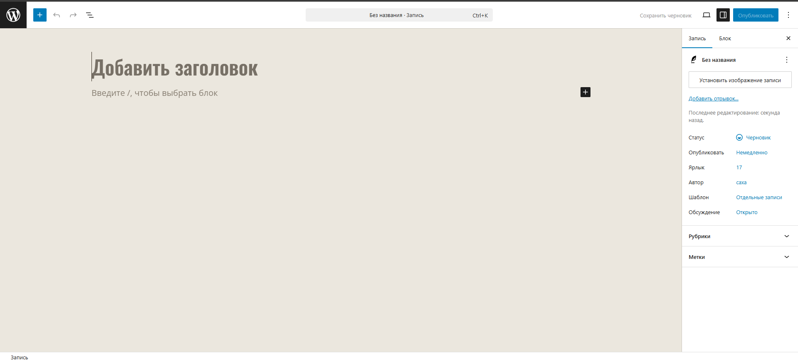
  
---
  
#### Шаг 6. Создание контента

Создаю новую страницу "Контакты" и вставляю туда созданную ранее форму:   
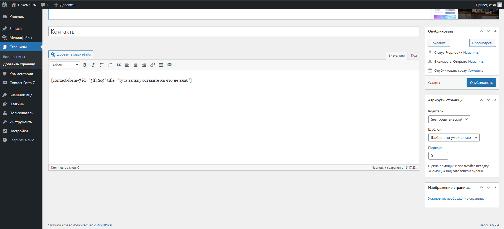  
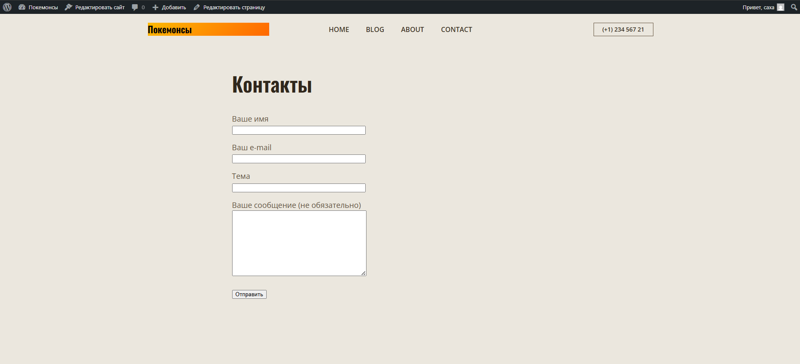
  
Далее создаю несколько новых записей с текстом и изоюражением:  
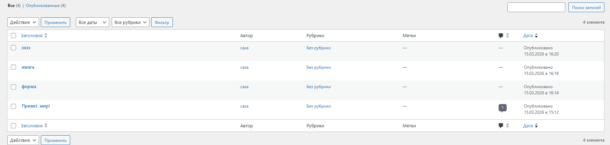
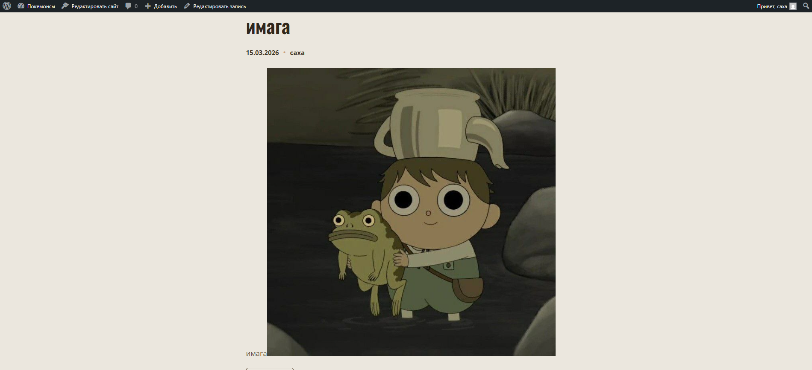
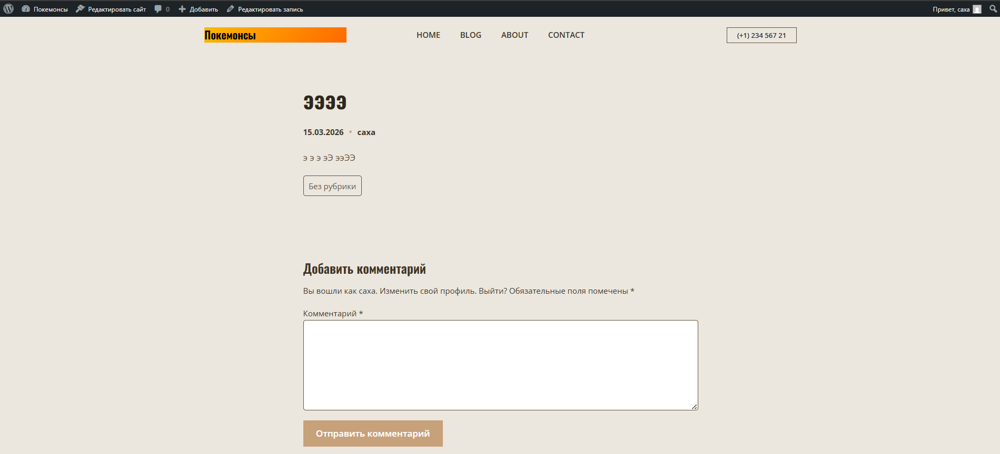
  
### Контрольные вопросы
**1. Что делает тема в WordPress, а что — плагин?**  
Тема отвечает за внешний вид сайта (дизайн, цвета, расположение элементов), а плагин добавляет новые функции (форма обратной связи, SEO, галерея и т.д.).  

**2. Почему при смене темы контент сайта не теряется?**  
Потому что контент хранится в базе данных WordPress, а тема отвечает только за то, как он отображается.

**3. Как можно изменить внешний вид сайта без редактирования кода?**  
Внешний вид сайт без редактирования кода можно изменить следующим образом:
- через настройщик темы (Customizer)
- с помощью готовых настроек темы
- через конструкторы страниц (например Elementor).
