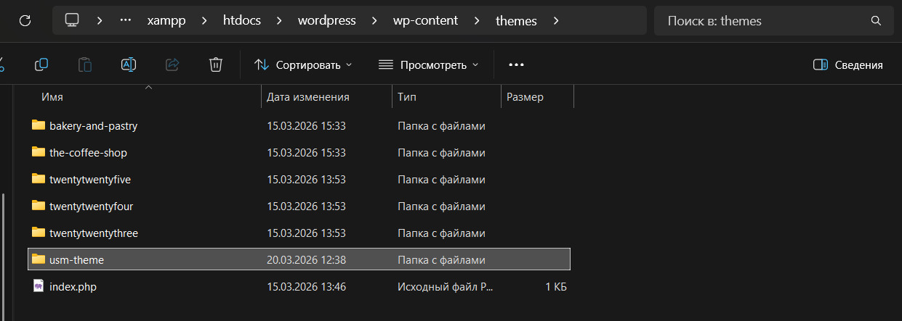
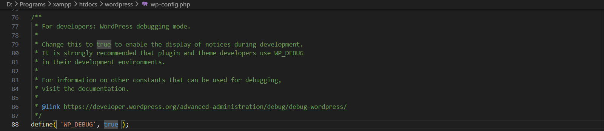
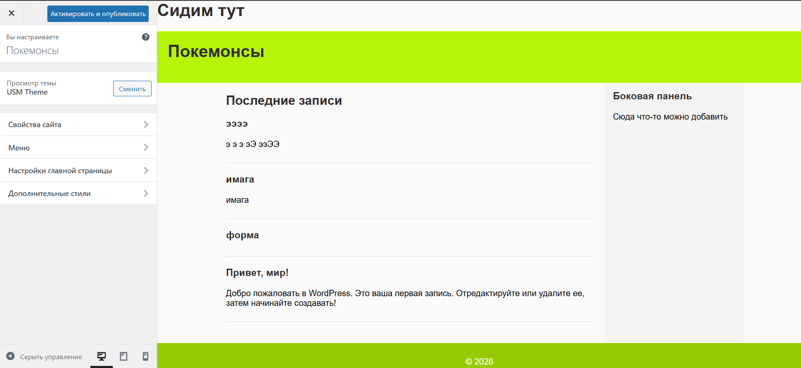
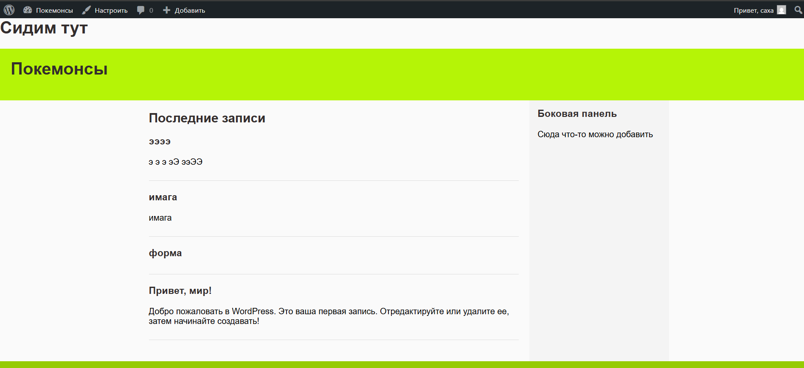

## Лабораторная работа №3. Разработка простой темы WordPress

### Цель работы
Научиться создавать собственную тему WordPress, разобраться в её минимальной структуре и принципах работы шаблонов.

### Ход работы

#### Шаг 1. Подготовка среды

На своей локальной установке WordPress перехожу в папку `wp-content/themes` и создаю директорию с названием `usm-theme` для своей будущей темы.  

  
В корневой директории WordPress перехожу в файл `wp-config.php` и включаю откладку, устанавливая true.  

   
---
   
#### Шаг 2. Создание обязательных файлов темы

В папке темы создаю файл для стилей с метаданными и после добавляю базовые css-правила.
`style.css`:
```css
/*
Theme Name: USM Theme
Author: Я
Description: Темачка
Version: 1.0
*/

body {
    font-family: Arial, sans-serif;
}
```

Далее создаю главный шаблон темы с базовой html-структурой для начала.
`index.php`:
```html
<!DOCTYPE html>
<html>
<head>
    <meta charset="UTF-8">
    <title>ТУТ</title>
</head>
<body>

<h1>Сидим тут</h1>

</body>
</html>
```
  
---
  
#### Шаг 3. Общие части шаблонов

Создаю файл хэдера с кодом шапки сайта.
`header.php`:
```html
<!DOCTYPE html>
<html>
<head>
    <meta charset="UTF-8">
    <title>ТУТАда</title>
</head>
<body>

<header>
    <h1>ТУДАта</h1>
</header>
```

После создаю файл футера с кодом подвала сайта.
`footer.php`:
```html
<footer>
    <p>© <?php echo date('Y'); ?></p>
</footer>

</body>
</html>
```
  
В `index.php` подключаю хэдер и футер с помощью функций `get_header()` и `get_footer()`.
  
На главной странице вывожу список последних записей (5 штук) с помощью цикла WordPress:
```php
<main>
    <h2>Последние записи</h2>

    <?php
        if (have_posts()) :
            $count = 0;
            while (have_posts() && $count < 5) : the_post();
                $count++;
        ?>
        <article>
            <h3><?php the_title(); ?></h3>
            <p><?php the_excerpt(); ?></p>
        </article>
    <?php
        endwhile;
        endif;
    ?>
</main>
```
  
---
  
#### Шаг 4. Файл функций

В папке темы создаю файл с функцией, которая подключает стили с помощью `wp_enqueue_style()` 
`functions.php`:
```php
<?php

function usm_theme_styles() {
    wp_enqueue_style('main-style', get_stylesheet_uri());
}

add_action('wp_enqueue_scripts', 'usm_theme_styles');
```
  
---
  
#### Шаг 5. Дополнительные шаблоны

В этом шаге я создаю ряд дополнительных шаблонов, такие как: файл для отображения отдельного поста 
`single.php`:
```php
<?php get_header(); ?>

<div class="container">

    <main>
        <?php if (have_posts()) : while (have_posts()) : the_post(); ?>
            <article>
                <h1><?php the_title(); ?></h1>
                <p><?php the_content(); ?></p>

                <?php comments_template(); ?>
            </article>
        <?php endwhile; endif; ?>
    </main>

    <?php get_sidebar(); ?>

</div>

<?php get_footer(); ?>
```

Файл для отображения страниц 
`page.php`:
```php
<?php get_header(); ?>

<div class="container">

    <main>
        <?php while (have_posts()) : the_post(); ?>
            <article>
                <h1><?php the_title(); ?></h1>
                <p><?php the_content(); ?></p>
            </article>
        <?php endwhile; ?>
    </main>

    <?php get_sidebar(); ?>

</div>

<?php get_footer(); ?>
```

Файл с боковой панелью 
`sidebar.php`:
```php
<aside>
    <h3>Боковая панель</h3>
    <p>Сюда что-то можно добавить</p>
</aside>
```

В файлах `index.php`, `single.php`, `page.php` подключаю сайдбар функцией `<?php get_sidebar(); ?>`.  
  
Файл для отображения архивов записей 
`archive.php`:
```php
<?php get_header(); ?>

<div class="container">

    <main>
        <h1>Архив</h1>

        <?php if (have_posts()) : while (have_posts()) : the_post(); ?>
            <article>
                <h3><?php the_title(); ?></h3>
                <p><?php the_excerpt(); ?></p>
            </article>
        <?php endwhile; endif; ?>
    </main>

    <?php get_sidebar(); ?>

</div>

<?php get_footer(); ?>
```
  
---
  
#### Шаг 6. Стилизация темы

Добавляю стили для основных элементов темы (шапка, подвал, контент, боковая панель и тд):
```css
header {
    background: #333;
    color: white;
    padding: 20px;
}

footer {
    background: #222;
    color: white;
    text-align: center;
    padding: 10px;
}

.container {
    display: flex;
    max-width: 1000px;
    margin: 0 auto;
}

main {
    padding: 20px;
}

aside {
    background: #f4f4f4;
    padding: 10px;
}

article {
    margin-bottom: 20px;
    padding-bottom: 10px;
    border-bottom: 1px solid #ddd;
}
```

И также для заголовков и ссылок:
```css
h1, h2, h3 {
    margin-top: 0;
    color: #332d2d;
}

a {
    color: #0073aa;
    text-decoration: none;
}

a:hover {
    text-decoration: underline;
}
```
  
---
  
#### Шаг 7. Скриншот темы

В папку темы добавляю также изображение [`screenshot.png`](usm-theme\screenshot.png), которое является превью моей темы, и будет отображаться в WordPress в допустимых темах.
  
---
  
#### Шаг 8. Активация темы

В админ-панели WordPress перехожу в раздел `Appearance` → `Themes`, нахожу свою тему и активирую её.  

  
Проверяю, как отображается сайт с моей темой.  


### Контрольные вопросы
**1. Какие два файла являются обязательными для любой темы WordPress?**  
Для любой темы WordPress такие файлы как `style.css` и `index.php` являются обязательными.
   
**2. Как подключаются общие части шаблонов (header, footer, sidebar)?**  
Общие части шаблонов подключается через фукции:
- get_header();
- get_footer();
- get_sidebar();
  
**3. Чем отличаются index.php, single.php и page.php?**  
`index.php`	- главный шаблон (fallback), `single.php`- один пост, `page.php` - страница
  
**4. Зачем нужен файл functions.php в теме?**  
Файл `functions.php` в теме нужен для подключения стилей и скриптов, регистрации меню, виджетов и добавления логики темы

### Список использованных источников
- https://elearning.usm.md/mod/assign/view.php?id=329459
- https://learn.wordpress.org/
- https://wordpress.org/documentation/