## Лабораторная работа №4. Разработка плагина для WordPress

### Цель работы
Освоить расширяемую модель данных WordPress: создать CPT (Custom Post Type), пользовательскую таксономию, метаданные с метабоксом в админ-панели, а также реализовать виджет для отображения данных на сайте.

### Ход работы

#### Шаг 1. Подготовка среды
В локальной установке WordPress перехожу в папку `wp-content/plugins` и создаю директорию для своего плагина `usm-notes`.  
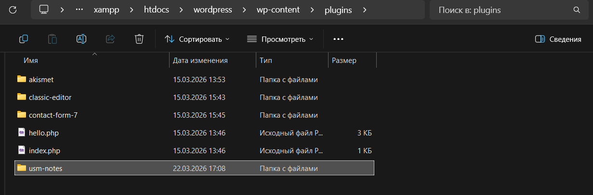  

В файле `wp-config.php` включаю откладку, меняя флаг с false на true:  
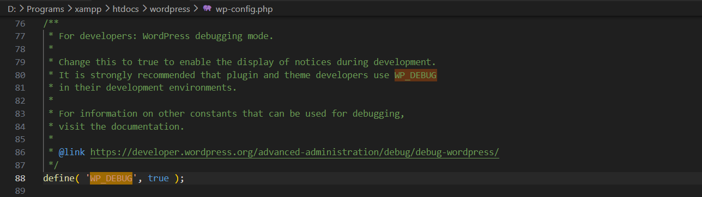  
  
---
  
#### Шаг 2. Создание основного файла плагина
В папке плагина создаю файл `usm-notes.php` и добавляю в него метаданные плагина(название, описание, версию, автора). После активирую плагин в WordPress.  
```php
/*
Plugin Name: usm notes
Description: ну это полезный плагин да
Version: 1.0
Author: я
*/
```
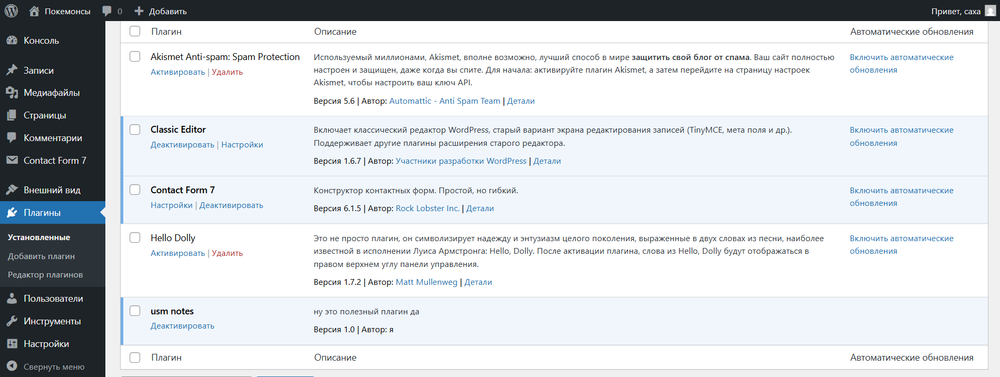
  
---
  
#### Шаг 3. Регистрация Custom Post Type (CPT)
CPT - это свой тип записей. WordPress по умолчанию умеет работать с post и page, а тут нужен новый тип "notes".
```php
function usm_register_notes_cpt() {
    $labels = array(
        'name'               => 'Заметки',
        'singular_name'      => 'Заметка',
        'menu_name'          => 'Заметки',
        'name_admin_bar'     => 'Заметка',
        'add_new'            => 'Добавить новую',
        'add_new_item'       => 'Добавить новую заметку',
        'new_item'           => 'Новая заметка',
        'edit_item'          => 'Редактировать заметку',
        'view_item'          => 'Просмотреть заметку',
        'all_items'          => 'Все заметки',
        'search_items'       => 'Искать заметки',
        'not_found'          => 'Заметки не найдены',
        'not_found_in_trash' => 'В корзине заметок нет',
    );

    $args = array(
        'labels'             => $labels,
        'public'             => true,
        'has_archive'        => true,
        'menu_icon'          => 'dashicons-edit-page',
        'supports'           => array( 'title', 'editor', 'author', 'thumbnail' ),
        'show_in_rest'       => true,
        'rewrite'            => array( 'slug' => 'notes' ),
    );

    register_post_type( 'usm_note', $args );
}
add_action( 'init', 'usm_register_notes_cpt' );
```
Создаёт новый тип записей - "Заметки". Из-за этой функции в админке появляется отдельный раздел, где можно создавать свои заметки.
  
---
  
#### Шаг 4. Регистрация пользовательской таксономии
Таксономия - это способ группировать записи.
```php
function usm_register_priority_taxonomy() {
    $labels = array(
        'name'              => 'Приоритеты',
        'singular_name'     => 'Приоритет',
        'search_items'      => 'Искать приоритеты',
        'all_items'         => 'Все приоритеты',
        'parent_item'       => 'Родительский приоритет',
        'parent_item_colon' => 'Родительский приоритет:',
        'edit_item'         => 'Редактировать приоритет',
        'update_item'       => 'Обновить приоритет',
        'add_new_item'      => 'Добавить новый приоритет',
        'new_item_name'     => 'Название нового приоритета',
        'menu_name'         => 'Приоритет',
    );

    $args = array(
        'hierarchical'      => true,
        'labels'            => $labels,
        'public'            => true,
        'show_in_rest'      => true,
        'rewrite'           => array( 'slug' => 'priority' ),
    );

    register_taxonomy( 'usm_priority', array( 'usm_note' ), $args );
}
add_action( 'init', 'usm_register_priority_taxonomy' );
```
Создаёт таксономию “Приоритет” для заметок. То есть к каждой заметке можно привязать, например, High, Medium, Low.
  
---
  
#### Шаг 5. Добавление метабокса для даты напоминания
Теперь делаю поле Due Date. Добавляю метабокс:
```php
function usm_add_due_date_meta_box() {
    add_meta_box(
        'usm_due_date_meta_box',
        'Дата напоминания',
        'usm_render_due_date_meta_box',
        'usm_note',
        'side',
        'default'
    );
}
add_action( 'add_meta_boxes', 'usm_add_due_date_meta_box' );
```
Добавляет сбоку в редакторе заметки блок с полем даты. Через него пользователь может выбрать дату напоминания.  
  
Также создаю функцию вывода поля:
```php
function usm_render_due_date_meta_box( $post ) {
    wp_nonce_field( 'usm_save_due_date', 'usm_due_date_nonce' );

    $due_date = get_post_meta( $post->ID, '_usm_due_date', true );

    echo '<label for="usm_due_date">Выберите дату:</label>';
    echo '<input type="date" id="usm_due_date" name="usm_due_date" value="' . esc_attr( $due_date ) . '" required style="width:100%; margin-top:8px;">';
}
```
Делает сам HTML-поле с датой внутри метабокса. Ещё подставляет уже сохранённую дату, если запись редактируют повторно.  
  
Функция сохранения даты:
```php
function usm_save_due_date_meta( $post_id ) {
    if ( ! isset( $_POST['usm_due_date_nonce'] ) ) {
        return;
    }

    if ( ! wp_verify_nonce( $_POST['usm_due_date_nonce'], 'usm_save_due_date' ) ) {
        return;
    }

    if ( defined( 'DOING_AUTOSAVE' ) && DOING_AUTOSAVE ) {
        return;
    }

    if ( ! current_user_can( 'edit_post', $post_id ) ) {
        return;
    }

    if ( isset( $_POST['post_type'] ) && 'usm_note' !== $_POST['post_type'] ) {
        return;
    }

    if ( ! isset( $_POST['usm_due_date'] ) || empty( $_POST['usm_due_date'] ) ) {
        add_filter( 'redirect_post_location', 'usm_due_date_required_error' );
        return;
    }

    $due_date = sanitize_text_field( $_POST['usm_due_date'] );
    $today    = date( 'Y-m-d' );

    $date_obj = DateTime::createFromFormat( 'Y-m-d', $due_date );
    $is_valid = $date_obj && $date_obj->format( 'Y-m-d' ) === $due_date;

    if ( ! $is_valid ) {
        add_filter( 'redirect_post_location', 'usm_due_date_invalid_error' );
        return;
    }

    if ( $due_date < $today ) {
        add_filter( 'redirect_post_location', 'usm_due_date_past_error' );
        return;
    }

    update_post_meta( $post_id, '_usm_due_date', $due_date );
}
add_action( 'save_post', 'usm_save_due_date_meta' );
```
Сохраняет дату напоминания при сохранении заметки. Заодно проверяет безопасность, пустое ли поле, правильная ли дата и не стоит ли дата в прошлом.  
  
Функция сообщения об ошибках:
```php
function usm_due_date_required_error( $location ) {
    return add_query_arg( 'usm_due_date_error', 'required', $location );
}

function usm_due_date_invalid_error( $location ) {
    return add_query_arg( 'usm_due_date_error', 'invalid', $location );
}

function usm_due_date_past_error( $location ) {
    return add_query_arg( 'usm_due_date_error', 'past', $location );
}
```
`usm_due_date_required_error($location)` - Добавляет в адрес страницы метку ошибки, если дата вообще не введена, потом по этой метке WordPress показывает сообщение.  
`usm_due_date_invalid_error($location)` - Добавляет метку ошибки, если дата введена в неправильном формате. Это нужно, чтобы потом вывести понятное сообщение в админке.  
`usm_due_date_past_error($location)` - Добавляет метку ошибки, если дата уже прошла, то есть напоминание нельзя ставить в прошлое.  
  
И функция вывода заметок в админке:
```php
function usm_due_date_admin_notices() {
    if ( ! isset( $_GET['usm_due_date_error'] ) ) {
        return;
    }

    $error = sanitize_text_field( $_GET['usm_due_date_error'] );

    if ( $error === 'required' ) {
        echo '<div class="notice notice-error is-dismissible"><p>Поле "Дата напоминания" обязательно для заполнения.</p></div>';
    }

    if ( $error === 'invalid' ) {
        echo '<div class="notice notice-error is-dismissible"><p>Указана некорректная дата.</p></div>';
    }

    if ( $error === 'past' ) {
        echo '<div class="notice notice-error is-dismissible"><p>Дата напоминания не может быть в прошлом.</p></div>';
    }
}
add_action( 'admin_notices', 'usm_due_date_admin_notices' );
```
Показывает сообщение об ошибке в админке, например: дата пустая, неправильная или в прошлом.  
  
Показ даты в списке записей CPT:
```php
function usm_add_due_date_column( $columns ) {
    $columns['usm_due_date'] = 'Дата напоминания';
    return $columns;
}
add_filter( 'manage_usm_note_posts_columns', 'usm_add_due_date_column' );

function usm_show_due_date_column( $column, $post_id ) {
    if ( 'usm_due_date' === $column ) {
        $due_date = get_post_meta( $post_id, '_usm_due_date', true );
        echo $due_date ? esc_html( $due_date ) : '—';
    }
}
add_action( 'manage_usm_note_posts_custom_column', 'usm_show_due_date_column', 10, 2 );
```
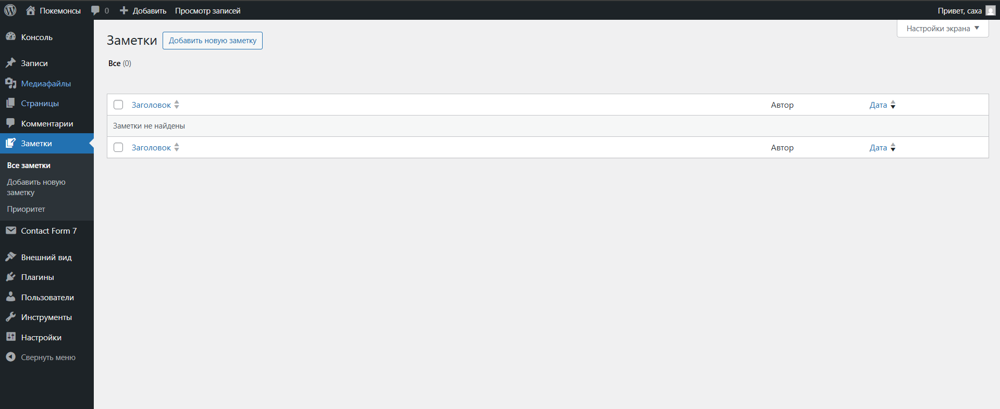
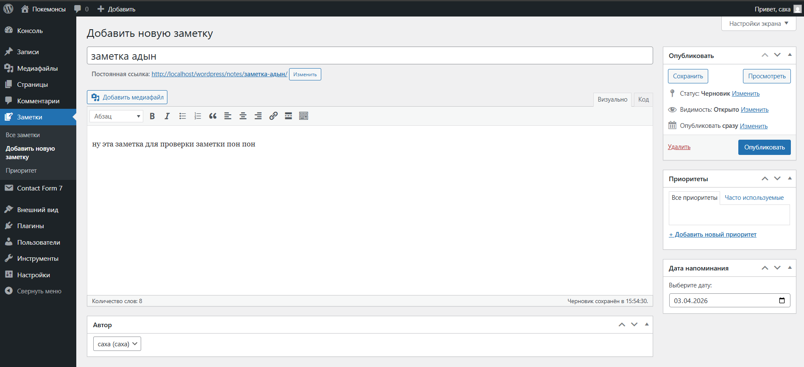
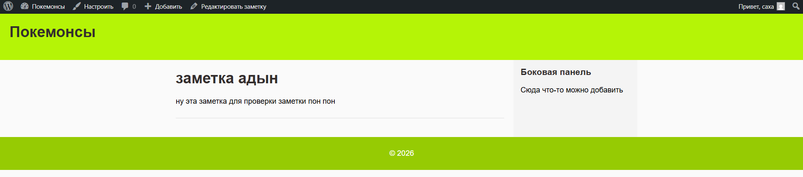
  
---
  
#### Шаг 6. Создание шорткода для отображения заметок
```php
function usm_notes_shortcode( $atts ) {
    $atts = shortcode_atts(
        array(
            'priority'    => '',
            'before_date' => '',
        ),
        $atts,
        'usm_notes'
    );

    $args = array(
        'post_type'      => 'usm_note',
        'post_status'    => 'publish',
        'posts_per_page' => -1,
    );

    if ( ! empty( $atts['priority'] ) ) {
        $args['tax_query'] = array(
            array(
                'taxonomy' => 'usm_priority',
                'field'    => 'slug',
                'terms'    => sanitize_text_field( $atts['priority'] ),
            ),
        );
    }

    if ( ! empty( $atts['before_date'] ) ) {
        $before_date = sanitize_text_field( $atts['before_date'] );

        $args['meta_query'] = array(
            array(
                'key'     => '_usm_due_date',
                'value'   => $before_date,
                'compare' => '<=',
                'type'    => 'DATE',
            ),
        );
    }

    $query = new WP_Query( $args );

    ob_start();

    echo '<div class="usm-notes-list">';

    if ( $query->have_posts() ) {
        while ( $query->have_posts() ) {
            $query->the_post();

            $due_date = get_post_meta( get_the_ID(), '_usm_due_date', true );
            $terms    = get_the_terms( get_the_ID(), 'usm_priority' );

            $priority_names = array();
            if ( $terms && ! is_wp_error( $terms ) ) {
                foreach ( $terms as $term ) {
                    $priority_names[] = $term->name;
                }
            }

            echo '<div class="usm-note-item">';
            echo '<h3>' . esc_html( get_the_title() ) . '</h3>';
            echo '<div class="usm-note-content">' . wp_kses_post( get_the_excerpt() ) . '</div>';
            echo '<p><strong>Приоритет:</strong> ' . esc_html( implode( ', ', $priority_names ) ) . '</p>';
            echo '<p><strong>Дата напоминания:</strong> ' . esc_html( $due_date ) . '</p>';
            echo '</div>';
        }
    } else {
        echo '<p>Нет заметок с заданными параметрами</p>';
    }

    echo '</div>';

    wp_reset_postdata();

    return ob_get_clean();
}
add_shortcode( 'usm_notes', 'usm_notes_shortcode' );
```
Обрабатывает шорткод `[usm_notes]`. Он ищет заметки, фильтрует их по приоритету и дате, а потом выводит на странице.  
  
Чтобы список выглядел прилично добавляю CSS:
```php
function usm_notes_styles() {
    echo '
    <style>
        .usm-notes-list {
            display: grid;
            gap: 16px;
            margin: 20px 0;
        }
        .usm-note-item {
            border: 1px solid #ddd;
            padding: 16px;
            border-radius: 8px;
            background: #fafafa;
        }
        .usm-note-item h3 {
            margin-top: 0;
            margin-bottom: 10px;
        }
        .usm-note-item p {
            margin: 8px 0;
        }
        .usm-note-content {
            margin-bottom: 10px;
        }
    </style>
    ';
}
add_action( 'wp_head', 'usm_notes_styles' );
```
  
---
  
#### Шаг 7. Тестирование плагина
Для тестирования создаю еще 7 заметок, указывая приоритет и дату:  
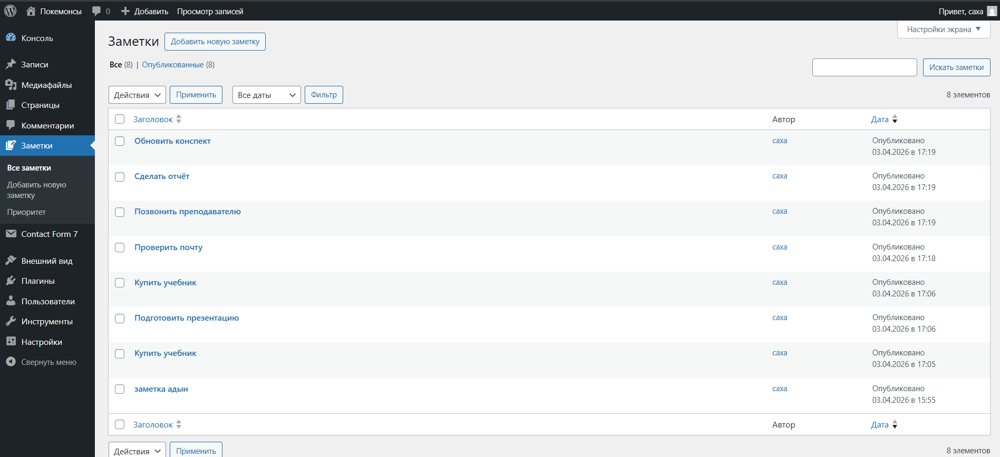
  
Специально для заметок создаю отдельную страницу "All Notes" и добавляю на нее проверочные шорткоды:  
[usm_notes]
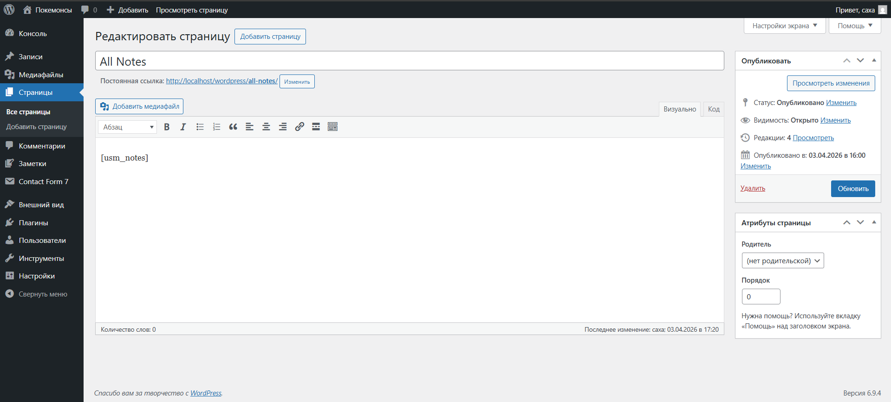
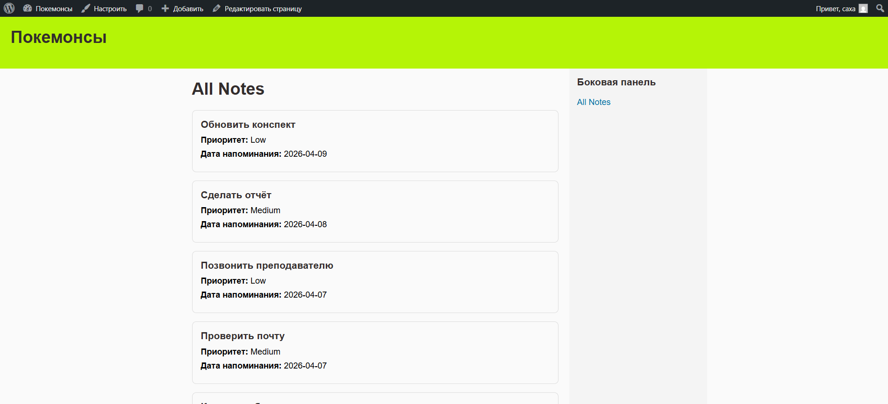

[usm_notes priority="high"]
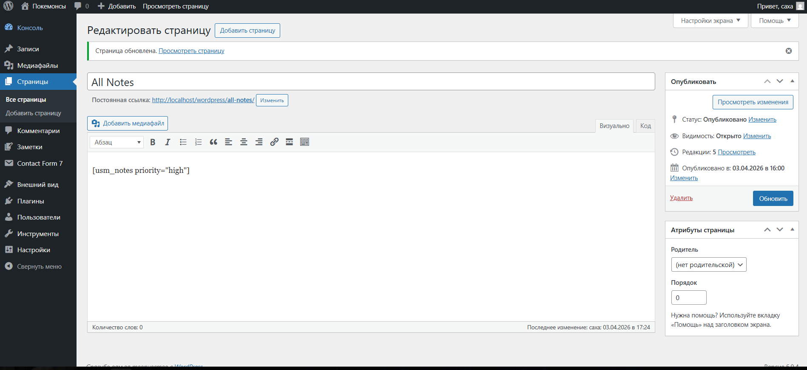
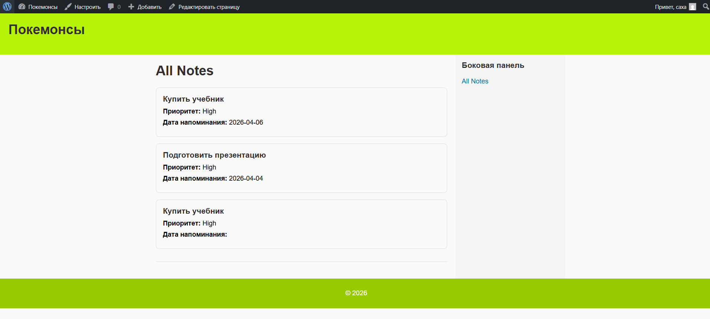

[usm_notes before_date="2026-04-06"]  
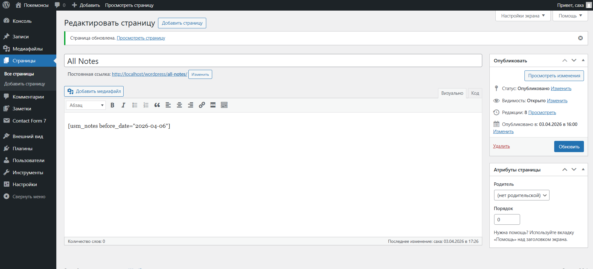
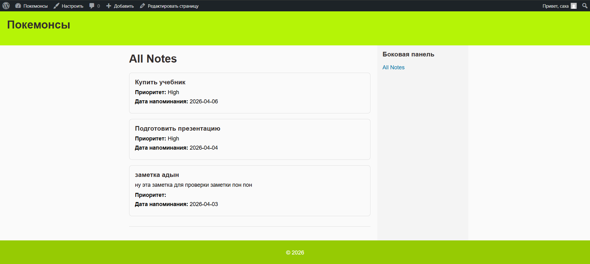

[usm_notes before_date="2025-04-30"]
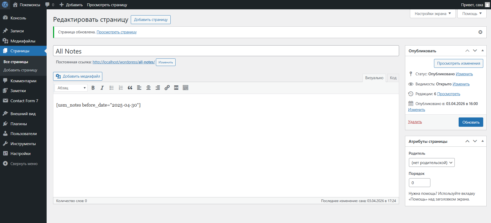
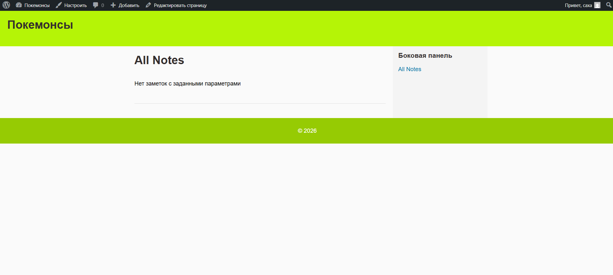


### Контрольные вопросы
**1. Чем пользовательская таксономия принципиально отличается от метаполя? Приведи пример, когда выбрать таксономию, а когда - метаданные**  
Таксономия нужна для группировки и классификации записей, если значения повторяются у многих записей и нужны для фильтрации. Пример: приоритеты High / Medium / Low, категории, теги. Метаполе нужно для дополнительного свойства конкретной записи, если значение индивидуально для каждой записи. Пример: дата напоминания, цена, артикул.
  
**2. Зачем нужен nonce при сохранении метаполей и что произойдёт, если его не проверять?**  
Nonce нужен для защиты формы от поддельных запросов (CSRF). Он проверяет, что данные отправлены из админки WordPress, а не с постороннего сайта. Если nonce не проверять, злоумышленник может подделать запрос и изменить метаполя записи.
  
**3. Какие аргументы register_post_type() и register_taxonomy() чаще всего важны для фронтенда и UX (назови минимум три и объясни почему).**  
Самые важные:
1. public - делает тип записи или таксономию доступными на сайте.
2. labels - делает интерфейс админки понятным и удобным.
3. has_archive - создаёт архивную страницу для CPT.
4. supports - определяет, какие поля доступны в редакторе.
5. hierarchical - задаёт поведение таксономии как у категорий.
6. rewrite - делает понятные и красивые URL.

### Список использованных источников
- https://learn.wordpress.org/
- https://wordpress.org/documentation/
- https://elearning.usm.md/mod/assign/view.php?id=329460